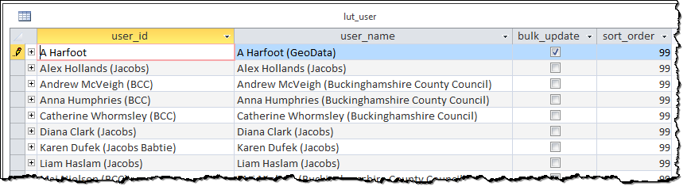
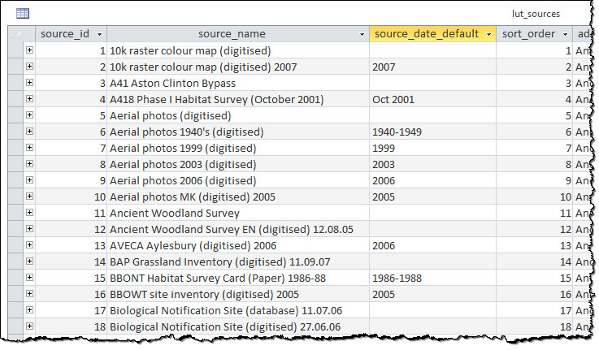
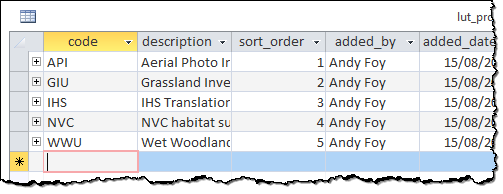
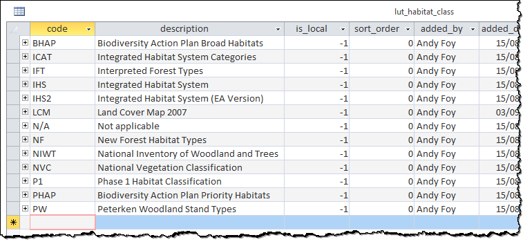
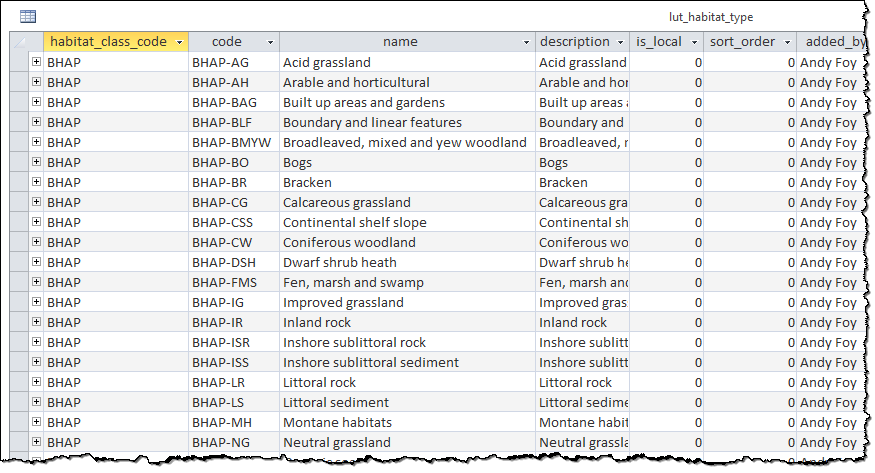
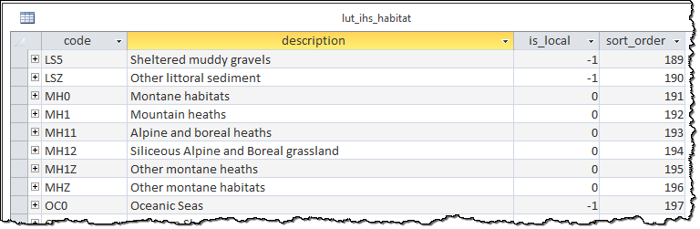
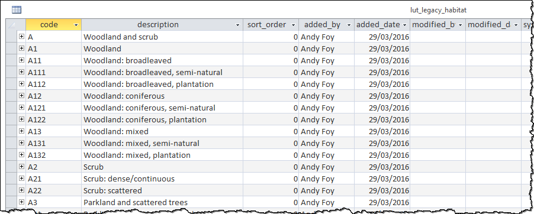
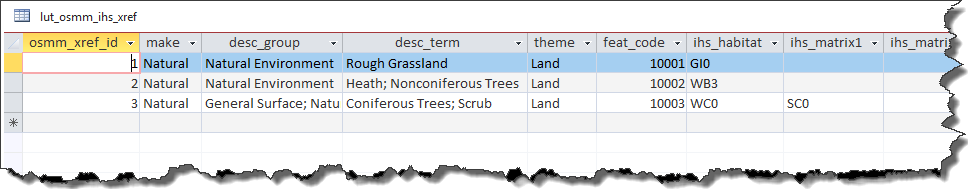
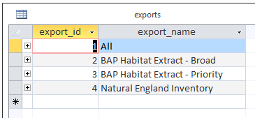
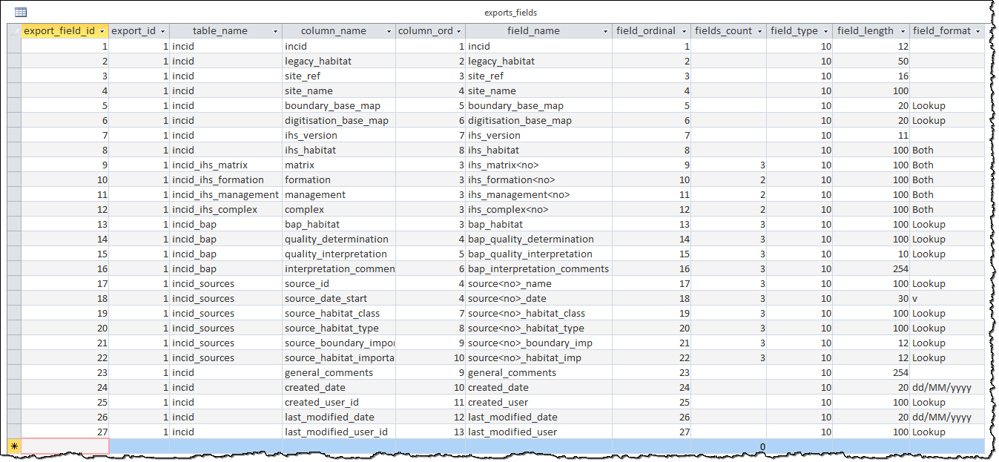

*************
Configuration
*************

The HLU Tool ArcGIS Pro add-in separates its settings into two levels:

* **Application-level settings** — shared across all users of the same ArcGIS Pro installation (e.g. database connection type, validation rules, bulk update defaults). Stored as XML in the add-in's :file:`.esriAddInX` folder within the ArcGIS Pro installation.
* **User-level settings** — specific to each Windows user (e.g. preferred interface options, default reason/process). Stored in the user's Windows roaming profile at :file:`%APPDATA%\\HLU\\HluGisTool`.

Because the HLU Tool is an embedded ArcGIS Pro add-in there is no separate GIS connection to configure — the active ArcGIS Pro map and the layer selected in the **Active Layer** drop-down on the ribbon serve as the GIS context.

.. index::
	single: Configuration; Database Connection

.. _database_connection:

Database Connection
===================

The HLU Tool supports connections to **SQL Server**, **PostgreSQL** and **Oracle** databases.

.. note::
	Microsoft Access is **not** supported as a backend database in this edition of the HLU Tool.

When the HLU Tool dockpane is opened for the first time (or after resetting the connection) a **Connection Type** dialog will appear, as shown in the figure :ref:`figCTD`, allowing you to select the database backend.

.. _figCTD:

.. figure:: figures/ConnectionTypeDialog.png
	:align: center
	:scale: 90

	Connection Type dialog

Select the appropriate connection type from the drop-down list and click :guilabel:`OK`.

.. raw:: latex

	\newpage

Connecting to SQL Server
------------------------

To connect the HLU Tool to a Microsoft SQL Server database:

	1. Select **SQLServer** from the Connection Type drop-down and click :guilabel:`OK`.

	2. Select the correct SQL Server instance from the drop-down list as shown in the figure :ref:`figSSCD`.

	.. _figSSCD:

	.. figure:: figures/SQLServerConnectionDialog.png
		:align: center
		:scale: 90

		SQL Server Connection dialog

	.. tip::
		If the server is listed but no service is shown (e.g. ``P3000CA\``), press :kbd:`End` to move the cursor to the end of the field and type the service name, or open **SQL Server Configuration Manager**, set **SQL Server Browser** to start automatically and restart the service.

	3. Select **Windows** or **SQL Server** authentication as configured on your server.

	4. If using SQL Server authentication, enter your **user name** and **password**.

	5. Select the HLU database from the **Database** drop-down list.

	6. The **Default schema** defaults to ``dbo``. Change this if required, then click :guilabel:`OK`.

.. raw:: latex

	\newpage

Connecting to PostgreSQL
------------------------

To connect the HLU Tool to a PostgreSQL database:

	1. Select **PostgreSQL** from the Connection Type drop-down and click :guilabel:`OK`.

	2. Enter the server hostname or IP address, port (default ``5432``), database name, user name and password in the connection dialog.

	3. Click :guilabel:`OK` to establish the connection.

Connecting to Oracle
--------------------

To connect the HLU Tool to an Oracle database:

	1. Select **Oracle** from the Connection Type drop-down and click :guilabel:`OK`.

	2. Enter the required connection details (TNS name or direct connection string, user name and password) in the connection dialog.

	3. Click :guilabel:`OK` to establish the connection.

.. raw:: latex

	\newpage

Resetting the Database Connection
----------------------------------

If the database server moves, the database name changes, or the connection becomes invalid, the saved connection settings can be cleared so that the connection wizard runs again on the next start-up.

To reset the connection:

	1. On the HLU Tool ribbon click **Options** to open the Options window.
	2. Navigate to **Application > Database** in the left-hand navigation list.
	3. Click :guilabel:`Reset Database Connection …`.
	4. Confirm the prompt. The saved connection details will be cleared.
	5. Close and re-open the HLU Tool dockpane. The Connection Type dialog will appear again.

.. raw:: latex

	\newpage

.. _configuring_luts:

Configuring Lookup Tables
=========================

Tables in the database that are prefixed by 'lut\_' are **lookup tables** and some of these can be tailored to the requirements of each organisation. Examples of configuration include:

	* Adding new users to enable edit capability.
	* Adding new sources as reference datasets.
	* Adding new legacy habitats.
	* Hiding 'non-local' habitats, habitat classes and habitat types.
	* Changing the order that the values appear in drop-down lists.

.. note::
	Changes to the lookup tables won't take effect for HLU Tool instances that are running. ArcGIS Pro will need to be restarted before any lookup table changes take effect.

.. seealso::
	See :ref:`lookup_tables` for more information on lookup tables.

.. index::
	single: Configuration; Users

.. _configuring_users:

Configuring Users
-----------------

New users of the HLU Tool must be added to the 'lut_user' table if they wish to apply any updates. The format of the table is shown in the figure :ref:`figDTLU`.

.. _figDTLU:

	Format of the lut_user table

.. note::

	* Users will be able to use the tool even if their user details have not been entered into the lut_user table. However, **[READ ONLY]** will appear in the dockpane header and they will not be able to apply any changes.
	* Users must also have edit access to the database and HLU feature layer in ArcGIS Pro in order to apply changes using the tool.
	* Existing user records cannot be removed from the 'lut_user' table if they are referenced by any of the data records (i.e. if they have applied any changes to the data). This is because data integrity must be retained.

.. caution::
	Bulk update permission should only be assigned to **expert** users and should only be used with caution as mistakes can have major affects on the data.

.. raw:: latex

	\newpage

.. index::
	single: Configuration; Sources

.. _configuring_sources:

Configuring Sources
-------------------

Additional sources can be added to the 'lut_sources' table. The format of the table is shown in the figure :ref:`figDTLS`.

.. _figDTLS:

	Format of the lut_sources table

.. note::
	Existing source records cannot be removed from the 'lut_sources' table if they are referenced by any of the data records (i.e. if they have been used in any incid data records). This is because data integrity must be retained.

.. raw:: latex

	\newpage

.. index::
	single: Configuration; Processes

.. _configuring_processes:

Configuring Processes
---------------------

New processes can be added to the 'lut_process' table. The format of the table is shown in the figure :ref:`figDTLP`.

.. _figDTLP:

	Format of the lut_process table

.. raw:: latex

	\newpage

.. index::
	single: Configuration; Habitat Class

.. _configuring_habitat_class:

Configuring Habitat Classes
---------------------------

Habitat Classes can be flagged as **local** or not in the 'lut_habitat_class` table. The format of the table is shown in the figure :ref:`figDTLHC`.

.. _figDTLHC:

	Format of the lut_habitat_class table

Setting the **local** flag of a Habitat Class to 'False' (zero) in the 'lut_habitat_class' table will stop it appearing in the 'Habitat Class' drop-down list in the Habitats tab of the dockpane and in the 'Habitat Class' drop-down list in the Sources tab.

.. note::
	Only Habitat Classes that are indirectly referenced by records in the 'lut_habitat_type_ihs_habitat' translation table will appear in the 'Habitat Class' drop-down list in the Habitats tab, even if the **is_local** flag is set to 'True'.

.. raw:: latex

	\newpage

.. index::
	single: Configuration; Habitat Type

.. _configuring_habitat_type:

Configuring Habitat Types
-------------------------

Habitat Types can be flagged as **local** in the 'lut_habitat_type` table. The format of the table is shown in the figure :ref:`figDTLHT`.

.. _figDTLHT:

	Format of the lut_habitat_type table

Setting the **local** flag of a Habitat Type to 'False' (zero) will stop it appearing in the 'Habitat Type' drop-down list in the Habitats tab and in the Sources tab.

.. note::
	Only Habitat Types that are directly referenced by records in the 'lut_habitat_type_ihs_habitat' translation table will appear in the 'Habitat Type' drop-down list in the Habitats tab, even if the **is_local** flag is set to 'True'.

.. raw:: latex

	\newpage

.. index::
	single: Configuration; IHS Habitats

.. _configuring_habitats:

Configuring IHS Habitats
------------------------

IHS Habitats can be flagged as **local** in the 'lut_ihs_habitat` table. The format of the table is shown in the figure :ref:`figDTLIH` (some columns have been hidden).

.. _figDTLIH:

	Format of the lut_ihs_habitat table

.. note::
	Only IHS Habitats flagged as **local** will appear in the 'IHS Habitat' drop-down list in the dockpane. This enables habitats that are not found in the local area to be hidden to avoid being selected in error (e.g. coastal habitats in land-locked counties.)

.. raw:: latex

	\newpage

.. index::
	single: Configuration; Legacy Habitats

.. _configuring_legacy_habitats:

Configuring Legacy Habitats
---------------------------

Legacy habitats can be configured in the 'lut_legacy_habitat` table. The format of the table is shown in the figure :ref:`figDTLLH`.

.. _figDTLLH:

	Format of the lut_legacy_habitat table

.. note::
	Existing legacy habitat records cannot be removed from the 'lut_legacy_habitat' table if they are referenced by any of the data records. This is because data integrity must be retained.

.. raw:: latex

	\newpage

.. index::
	single: Configuration; OSMM to IHS cross-reference

.. _configuring_osmm_ihx_xref:

Configuring OSMM to IHS cross-reference
---------------------------------------

The OS MasterMap to IHS cross-reference can be configured in the 'lut_osmm_ihs_xref` table. The format of the table is shown in the figure :ref:`figDTLOIX`.

.. _figDTLOIX:

	Format of the lut_osmm_ihs_xref table

.. note::
	Existing OS MasterMap to IHS cross-reference records cannot be removed from the 'lut_osmm_ihs_xref' table as they will be referenced by one or more records in the **incid_osmm_updates** table. This is because data integrity must be retained.

.. raw:: latex

	\newpage

.. index::
	single: Configuration; Exports
	single: Exports; Export Formats

.. _configuring_exports:

Configuring Exports
===================

Export formats must be pre-configured before they can be used in the HLU Tool.

Adding export formats
---------------------

Export formats can be added or removed in the 'exports' table shown in the figure :ref:`figDTE`.

.. _figDTE:

	Format of the exports table

Once a new export format has been added to the 'exports' table the fields to be included in the export must be added to the 'exports_fields' table.

.. index::
	single: Exports; Export Fields

Adding fields to an export format
---------------------------------

The 'exports_fields' table shown in the figure :ref:`figDTEF` defines which fields are exported for each export type in the 'exports' table.

.. _figDTEF:

	Format of the exports_fields table

.. note::
	GIS controlled fields such as shape, perimeter, area, etc. should not be included. These fields will be automatically added to the exported layer.

.. seealso::
	See :ref:`export_tables` for more information.

.. index::
	single: Exports; Field Formats

.. _export_field_formats:

Field Formats
-------------

The format of some export fields can be modified in the output file.

**Lookup related fields**
The format of all fields that relate to a lookup 'lut\_' table record can be modified using the following formats:

	.. tabularcolumns:: |L|L|L|

	.. table:: Valid Export Field Formats for fields with related lookup tables

		+-----------------+--------------------------------------------------------------------------------+-------------------------+
		|   Field Format  |                                  Description                                   |         Example         |
		+=================+================================================================================+=========================+
		| Code (or blank) | Outputs **only** the raw 'code' value of the specified field.                  | 'GA0'.                  |
		+-----------------+--------------------------------------------------------------------------------+-------------------------+
		| Lookup          | Outputs **only** the 'description' field value from the relevant lookup table. | 'Acid Grassland'.       |
		+-----------------+--------------------------------------------------------------------------------+-------------------------+
		| Both            | Outputs **both** the 'code' **and** 'description' values separated by ' : '.   | 'GA0 : Acid Grassland'. |
		+-----------------+--------------------------------------------------------------------------------+-------------------------+

.. note::
	* The above 'field_format' values (i.e. 'Code,' 'Lookup' and 'Both') are **case sensitive**.
	* The 'field_type' must be '10' (text) for the specified field.
	* The 'field_length' must be long enough to contain the specified output format (up to 254 chars) or it will be truncated.

**Source date fields**
The format of the 'source_date_start' and 'source_date_end' fields in the 'incid_sources' table can be modified using the following field formats:

	.. tabularcolumns:: |L|L|L|

	.. table:: Valid Export Field Formats for source date fields

		+--------------+---------------------------------------------------------+---------------------------------+
		| Field Format |                    Output Description                   |             Example             |
		+==============+=========================================================+=================================+
		| blank        | Start **or** End date in the format entered.            | 'Jul 2008' or 'Nov 2009'        |
		+--------------+---------------------------------------------------------+---------------------------------+
		| 'v'          | **Both** Start **and** End dates in the format entered. | 'Jul 2008 - Nov 2009'.          |
		+--------------+---------------------------------------------------------+---------------------------------+
		| 'dd/MM/yyyy' | Start or End date as 'day/month/year'.                  | '01/07/2008' or '01/11/2009'.   |
		+--------------+---------------------------------------------------------+---------------------------------+
		| 'mmm yyyy'   | Start or End date as 'month year'.                      | 'Jul 2008' or 'Nov 2009'.       |
		+--------------+---------------------------------------------------------+---------------------------------+
		| 'yyyy'       | Start or End date as 'year' only.                       | '2008' or '2009'.               |
		+--------------+---------------------------------------------------------+---------------------------------+
		| 'D'          | Start or End date in the vague 'day' format.            | '01/07/2008' or '01/11/2009'.   |
		+--------------+---------------------------------------------------------+---------------------------------+
		| 'O'          | Start or End date in the vague 'month year' format.     | 'Jul 2008' or 'Nov 2009'.       |
		+--------------+---------------------------------------------------------+---------------------------------+
		| 'Y'          | Start or End date in the vague 'year' format.           | '2008' or '2009'.               |
		+--------------+---------------------------------------------------------+---------------------------------+
		| 'P'          | Start or End date in the vague 'season year' format.    | 'Summer 2008' or 'Autumn 2009'. |
		+--------------+---------------------------------------------------------+---------------------------------+

.. note::
	* The above 'field_format' values are **case sensitive**.
	* The 'field format' value 'v' can be used with wither the 'source_date_start' or 'source_date_end' fields.
	* The 'field_type' must be '10' (text) for the specified field.
	* The 'field_length' must be long enough to contain the specified output format (up to 254 chars) or it will be truncated.

.. caution::
	* When using the field format **'dd/MM/yyyy'** the month portion **'MM'** must be in capitals (lower case 'mm' means 'minutes' not 'Months').
	* Because of the way Source dates are stored in the database, dates entered as a single date (e.g. '01/07/2008' or '2008') rather than a date range (e.g. '01/07/2008 - 30/11/2009' or '- 2008') will always have a 'source_date_end' of 'Unknown' or blank (depending on the chosen output format).
	* Vague dates (e.g. 'Jul 2008' or '2008') are stored based on the first day of the relevant period, so if output in a more precise format (e.g. entered as '2008' but output as 'mmm yyyy') the day and/or month output will be the first day/month of the relevant period.

**Date field specifiers**
The following table describes the valid date and time format specifiers.

	.. tabularcolumns:: |L|L|

	.. table:: Valid date and time format specifiers

		+-----------+------------------------------------------------+
		| Specifier |                  Description                   |
		+===========+================================================+
		| "d"       | The day of the month, from 1 through 31.       |
		+-----------+------------------------------------------------+
		| "dd"      | The day of the month, from 01 through 31.      |
		+-----------+------------------------------------------------+
		| "ddd"     | The abbreviated name of the day of the week.   |
		+-----------+------------------------------------------------+
		| "dddd"    | The full name of the day of the week.          |
		+-----------+------------------------------------------------+
		| "h"       | The hour, using a 12-hour clock from 1 to 12.  |
		+-----------+------------------------------------------------+
		| "hh"      | The hour, using a 12-hour clock from 01 to 12. |
		+-----------+------------------------------------------------+
		| "H"       | The hour, using a 24-hour clock from 0 to 23.  |
		+-----------+------------------------------------------------+
		| "HH"      | The hour, using a 24-hour clock from 00 to 23. |
		+-----------+------------------------------------------------+
		| "m"       | The minute, from 0 through 59.                 |
		+-----------+------------------------------------------------+
		| "mm"      | The minute, from 00 through 59.                |
		+-----------+------------------------------------------------+
		| "M"       | The month, from 1 through 12.                  |
		+-----------+------------------------------------------------+
		| "MM"      | The month, from 01 through 12.                 |
		+-----------+------------------------------------------------+
		| "MMM"     | The abbreviated name of the month.             |
		+-----------+------------------------------------------------+
		| "MMMM"    | The full name of the month.                    |
		+-----------+------------------------------------------------+
		| "s"       | The second, from 0 through 59.                 |
		+-----------+------------------------------------------------+
		| "ss"      | The second, from 00 through 59.                |
		+-----------+------------------------------------------------+
		| "t"       | The first character of the AM/PM designator.   |
		+-----------+------------------------------------------------+
		| "tt"      | The AM/PM designator.                          |
		+-----------+------------------------------------------------+
		| "y"       | The year, from 0 to 99.                        |
		+-----------+------------------------------------------------+
		| "yy"      | The year, from 00 to 99.                       |
		+-----------+------------------------------------------------+
		| "yyyy"    | The year as a four-digit number.               |
		+-----------+------------------------------------------------+
		| ":"       | The time separator.                            |
		+-----------+------------------------------------------------+
		| "/"       | The date separator.                            |
		+-----------+------------------------------------------------+
		| space     | Date or time spacing character.                |
		+-----------+------------------------------------------------+

