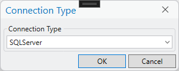

*************
Configuration
*************

The HLU Tool ArcGIS Pro add-in separates its settings into two levels:

**Application-level settings**
	These are shared across all users of the same ArcGIS Pro installation (e.g. database connection type, validation rules, bulk update defaults). Application options are stored in a **HLUTool.xml** file in the same folder as the tool add-in **.esriAddinX** file loaded in ArcGIS Pro.

**User-level settings**
	These are specific to each Windows user (e.g. preferred interface options, default reason/process). User options are stored in a **user.config** file in the user's roaming folder, e.g. **%AppData%\Esri\ArcGISPro_StrongName_[hash]\[version]** where ``[version]`` relates to the version of ArcGIS Pro installed (such as ``3.4.0.0``).

Because the HLU Tool is an embedded ArcGIS Pro add-in there is no separate GIS connection to configure — the active ArcGIS Pro map and the layer selected in the **Active Layer** drop-down on the ribbon serve as the GIS context.

.. index::
	single: Configuration; Database Connection

.. _database_connection:

Database Connection
===================

The HLU Tool supports connections to **SQL Server**, **PostgreSQL** and **Oracle** databases.

.. note::
	Microsoft Access is **not** supported as a backend database in this edition of the HLU Tool.

When the HLU Tool dockpane is opened for the first time (or after resetting the connection) a **Connection Type** dialog will appear, as shown in the figure :ref:`figCTD`, allowing you to select the database backend.

.. _figCTD:

	Connection Type dialog

Select the appropriate connection type from the drop-down list and click :guilabel:`OK`.

.. raw:: latex

	\newpage

Connecting to SQL Server
------------------------

To connect the HLU Tool to a Microsoft SQL Server database:

	1. Select **SQLServer** from the Connection Type drop-down and click :guilabel:`OK`.

	2. Select the correct SQL Server instance from the drop-down list as shown in the figure :ref:`figSSCD`.

	.. _figSSCD:

	.. figure:: figures/SQLServerConnectionDialog.png
		:align: center
		:scale: 90

		SQL Server Connection dialog

	.. tip::
		If the server is listed but no service is shown (e.g. ``P3000CA\``), press :kbd:`End` to move the cursor to the end of the field and type the service name, or open **SQL Server Configuration Manager**, set **SQL Server Browser** to start automatically and restart the service.

	3. Select **Windows** or **SQL Server** authentication as configured on your server.

	4. If using SQL Server authentication, enter your **user name** and **password**.

	5. Select the HLU database from the **Database** drop-down list.

	6. The **Default schema** defaults to ``dbo``. Change this if required, then click :guilabel:`OK`.

.. raw:: latex

	\newpage

Connecting to PostgreSQL
------------------------

To connect the HLU Tool to a PostgreSQL database:

	1. Select **PostgreSQL** from the Connection Type drop-down and click :guilabel:`OK`.

	2. Enter the server hostname or IP address, port (default ``5432``), database name, user name and password in the connection dialog.

	3. Click :guilabel:`OK` to establish the connection.

Connecting to Oracle
--------------------

To connect the HLU Tool to an Oracle database:

	1. Select **Oracle** from the Connection Type drop-down and click :guilabel:`OK`.

	2. Enter the required connection details (TNS name or direct connection string, user name and password) in the connection dialog.

	3. Click :guilabel:`OK` to establish the connection.

.. raw:: latex

	\newpage

Resetting the Database Connection
----------------------------------

If the database server moves, the database name changes, or the connection becomes invalid, the saved connection settings can be cleared so that the connection wizard runs again on the next start-up.

To reset the connection:

	1. On the HLU Tool ribbon click **Options** to open the Options window.
	2. Navigate to **Application > Database** in the left-hand navigation list.
	3. Click :guilabel:`Reset Database Connection …`.
	4. Confirm the prompt. The saved connection details will be cleared.
	5. Close and re-open the HLU Tool dockpane. The Connection Type dialog will appear again.

.. raw:: latex

	\newpage

.. _configuring_luts:

Configuring Lookup Tables
=========================

Tables in the database that are prefixed by 'lut\_' are **lookup tables** and some of these can be tailored to the requirements of each organisation. Examples of configuration include:

	* Adding new users to enable edit capability.
	* Adding new sources as reference datasets.
	* Adding new legacy habitats.
	* Hiding 'non-local' habitats, habitat classes and habitat types.
	* Changing the order that the values appear in drop-down lists.

.. caution::
	It is essential that the structure of these tables is not altered, and we recommend that any updates to the data in these tables are carried out solely by the database administrator.

.. note::
	Changes to the lookup tables won't take effect for HLU Tool instances that are running. ArcGIS Pro will need to be restarted before any lookup table changes take effect.

.. seealso::
	See :ref:`lookup_tables` for more information on lookup tables.

.. index::
	single: Configuration; Users

.. _configuring_users:

Configuring Users
-----------------

The 'lut_user' table contains details of all the users that have editing capability with the HLU Tool and indicates if they are also able to perform ‘bulk’ updates. New users of the HLU Tool must be added to the table if they wish to apply any updates. Users will be able to use the tool to view attributes, even if their user details have not been entered into the lut_user table, but **[READ ONLY]** will appear in the dockpane header and they will not be able to apply any changes.

.. note::

	* Users must also have edit access to the database and HLU feature layer in ArcGIS Pro in order to apply changes using the tool.
	* Existing user records cannot be removed from the 'lut_user' table if they are referenced by any of the data records (i.e. if they have applied any changes to the data). This is because data integrity must be retained.

.. caution::
	Bulk update permission should only be assigned to **expert** users and should only be used with caution as mistakes can have major affects on the data.

.. note::
	The attribute **sort_order** is not used. This attribute may be removed in a future update.

.. seealso::
	See :ref:`lut_users` for more information on the lut_users table.

.. index::
	single: Configuration; Sources

.. _configuring_sources:

Configuring Sources
-------------------

The 'lut_sources' table contains details of all the source datasets that can be referenced by any of the Sources for an INCID. New sources can be added to this table to allow them to be selected in the ‘Sources’ tab of the dockpane.

.. note::
	Old source records cannot be removed from the 'lut_sources' table if they are referenced by any of the data records (i.e. if they have been used in any incid data records). This is because data integrity must be retained. Instead, the source name should be prefixed with '[Inactive] - ' and the sort_order changed to 999 so that it is less likely to be selected in the 'Sources' tab.

.. seealso::
	See :ref:`lut_sources` for more information on the lut_sources table.

.. index::
	single: Configuration; Processes

.. _configuring_processes:

Configuring Processes
---------------------

The 'lut_process' table contains details of all the processes that can be referenced as the activity being undertaken when applying updates with the HLU Tool. New processes can be added to this table to allow them to be selected in the 'Process' field on the tool ribbon.

.. note::
	Old process records cannot be removed from the 'lut_process' table if they are referenced by any of the data records (i.e. if they have been used in any history records). This is because data integrity must be retained. Instead, the description should be prefixed with '[Inactive] - ' and the sort_order changed to 999 so that it is less likely to be selected in the 'Process' list in the ribbon.

.. seealso::
	See :ref:`lut_process` for more information on the lut_process table.

.. index::
	single: Configuration; Legacy Habitats

.. _configuring_legacy_habitats:

Configuring Legacy Habitats
---------------------------

The 'lut_legacy_habitat' table contains all of the legacy habitats that can be referenced by an INCID. New legacy habitats can be added to this table to allow them to be selected in the 'Legacy Habitat' drop-down list on the 'Habitats' tab.

.. note::
	Existing legacy habitat records cannot be removed from the 'lut_legacy_habitat' table if they are referenced by any of the data records. This is because data integrity must be retained.

.. seealso::
	See :ref:`lut_legacy_habitat` for more information on the lut_legacy_habitat table.

.. index::
	single: Configuration; OSMM to habitat cross-reference

.. _configuring_osmm_habitat_xref:

Configuring OSMM to habitat cross-reference
-------------------------------------------

The 'lut_osmm_habitat_xref' table contains a cross-reference between OS MasterMap feature types and the primary and secondary habitat codes. Each row represents a unique combination of OSMM attributes plus the corrsponding primary and secondary habitat codes. It is used when reviewing and bulk applying proposed OSMM Updates and when bulk loading OSMM features. New entries can be added to this table to allow them to be referenced by upcoming OSMM updates or input source layers containing new OSMM features to be bulk loaded.

.. note::
	Existing OS MasterMap to habitat cross-reference records cannot be removed from the 'lut_osmm_habitat_xref' table if they are referenced by one or more records in the **incid_osmm_updates** table. This is because data integrity must be retained.

.. seealso::
	See :ref:`lut_osmm_habitat_xref` for more information on the lut_osmm_habitat_xref table.

.. index::
	single: Configuration; Habitat Class

.. _configuring_habitat_class:

Configuring Habitat Classes
---------------------------

The 'lut_habitat_class' table contains details of all the habitat classification systems (e.g. UKHab, Phase 1, IHS, NVC) that can be used to filter the primary habitat code selection on the Habitats tab of the dockpane.

New habitat classes are typically only added by the system developer, but some changes can be applied to existing rows by changing the following fields:

is_local
	Setting the **is_local** flag of a Habitat Class to 'False' (zero) in the table will stop it appearing in the 'Habitat Class' drop-down list in the Habitats tab of the dockpane and in the 'Habitat Class' drop-down list in the Sources tab.

sort_order
	Changing the **sort_order** numeric value will alter the order that Habitat Classes appear in the 'Habitat Class' drop-down list in the Habitats tab of the dockpane and in the 'Habitat Class' drop-down list in the Sources tab.

.. note::
	Only Habitat Classes that are indirectly referenced by records in the 'lut_habitat_type_primary' translation table will appear in the 'Habitat Class' drop-down list in the Habitats tab, even if the **is_local** flag is set to 'True'.

.. seealso::
	See :ref:`lut_habitat_class` for more information on the lut_habitat_class table.

.. index::
	single: Configuration; Habitat Type

.. _configuring_habitat_type:

Configuring Habitat Types
-------------------------

The 'lut_habitat_type` table contains details of all the habitat types within each habitat classification. Selecting a habitat type on the Habitats tab filters the ‘Primary’ drop-down list to show only relevant primary habitat codes.

New habitat classes are typically only added by the system developer, but some changes can be applied to existing rows by changing the following fields:

is_local
	Setting the **is_local** flag of a Habitat Type to 'False' (zero) in the table will stop it appearing in the 'Habitat Type' drop-down list in the Habitats tab of the dockpane and in the 'Habitat Type' drop-down list in the Sources tab.

sort_order
	Changing the **sort_order** numeric value will alter the order that Habitat Types appear in the 'Habitat Type' drop-down list in the Habitats tab of the dockpane and in the 'Habitat Type' drop-down list in the Sources tab.

.. note::
	Only Habitat Types that are directly referenced by records in the 'lut_habitat_type_primary' translation table will appear in the 'Habitat Type' drop-down list in the Habitats tab, even if the **is_local** flag is set to 'True'.

.. seealso::
	See :ref:`lut_habitat_type` for more information on the lut_habitat_type table.

.. index::
	single: Configuration; Primary Category

.. _configuring_primary_categories:

Configuring Primary Categories
------------------------------

The 'lut_primary_category` table contains all the primary habitat categories that contain all of the primary habitat codes. The categories don't appear in the dockpane, it simply acts as a high-level filter for which primary codes will appear in drop-down lists.

New primary code categories are typically only added by the system developer, but some changes can be applied to existing rows by changing the following fields:

is_local
	Setting the **is_local** flag of a primary code to 'False' (zero) in the table will stop it appearing in the 'Primary' drop-down list in the Habitats tab of the dockpane. This enables all primary habitat within a category that are not found in the local area (e.g. coastal habitats in land-locked counties) to be hidden to avoid being selected in error.

sort_order
	Not used. This attribute may be removed in a future update.

.. seealso::
	See :ref:`lut_primary_category` for more information on the lut_primary_category table.

.. index::
	single: Configuration; Primary Habitat

.. _configuring_primary_habitats:

Configuring Primary Habitats
----------------------------

The 'lut_primary` table contains all the primary habitat codes that can be assigned to an INCID. The codes that appear in the ‘Primary’ drop-down list on the Habitats tab are determined by the selected habitat class and type via the lut_habitat_type_primary cross-reference table.

New primary codes are typically only added by the system developer, but some changes can be applied to existing rows by changing the following fields:

is_local
	Setting the **is_local** flag of a primary code to 'False' (zero) in the table will stop it appearing in the 'Primary' drop-down list in the Habitats tab of the dockpane. This enables primary habitats that are not found in the local area (e.g. coastal habitats in land-locked counties) to be hidden to avoid being selected in error.

sort_order
	Changing the **sort_order** numeric value will alter the order that primary codes appear in the 'Primary' drop-down list in the Habitats tab of the dockpane.

.. seealso::
	See :ref:`lut_primary` for more information on the lut_primary table.

.. index::
	single: Configuration; Secondary Groups

.. _configuring_secondary_groups:

Configuring Secondary Groups
-----------------------------

The 'lut_secondary_group` table groups secondary habitat codes into related groups. The categories appear in the secondary habitats list 'Group' drop-down list on the 'Habitats' tab to help users narrow down secondary code choices.

New secondary groups are typically only added by the system developer, but some changes can be applied to existing rows by changing the following fields:

is_local
	Setting the **is_local** flag of a secondary code to 'False' (zero) in the table will stop it appearing in the secondary habitats list 'Group' drop-down list in the Habitats tab of the dockpane. This enables secondary habitats that are not found in the local area (e.g. coast secondary features in land-locked counties) to be hidden to avoid being selected in error.

sort_order
	Changing the **sort_order** numeric value will alter the order that secondary categories appear in the secondary habitats list 'Group' drop-down list in the Habitats tab of the dockpane.

.. note::
	Only categories that contain one or more secondary habitat codes that are valid for the selected primary habitat will appear in the drop-down list, even if the **is_local** flag is set to 'True'.

.. seealso::
	See :ref:`lut_secondary_group` for more information on the lut_secondary_group table.

.. index::
	single: Configuration; Secondary Habitat

.. _configuring_secondary_habitats:

Configuring Secondary Habitats
------------------------------

The 'lut_secondary' table contains all the secondary habitat codes that can be assigned to an INCID alongside a primary habitat code. The codes that appear in the secondary habitats list 'Code' drop-down list on the 'Habitats' tab are filtered by the selected secondary group and by the selected primary habitat via the lut_primary_secondary cross-reference table.

New secondary codes are typically only added by the system developer, but some changes can be applied to existing rows by changing the following fields:

is_local
	Setting the **is_local** flag of a secondary code to 'False' (zero) in the table will stop it appearing in the secondary habitats list 'Code' drop-down list in the Habitats tab of the dockpane. This enables secondary habitats that are not found in the local area (e.g. coastal features in land-locked counties) to be hidden to avoid being selected in error.

sort_order
	Changing the **sort_order** numeric value will alter the order that secondary codes appear in the secondary habitats list 'Code' drop-down list in the Habitats tab of the dockpane.

.. seealso::
	See :ref:`lut_secondary` for more information on the lut_secondary table.

.. index::
	single: Configuration; Habitat Type to Primary Habitat cross-reference

.. _configuring_habitat_type_primary:

Configuring Habitat Type to Primary Habitat cross-reference
-----------------------------------------------------------

The 'lut_habitat_type_primary' cross-reference table maps habitat types to their valid and preferred primary habitat codes, and their suggested secondary codes and habitat tips. It controls which primary codes appear in the 'Primary' drop-down list for a selected habitat type, and whether a code is shown as 'preferred' (above the divider line and in bold) or not. Each record maps a Habitat Type (``code_habitat_type``) to a Primary Habitat (``code_primary``). The optional ``habitat_secondaries`` column can contain a comma-separated list of secondary habitat codes that are typically associated with that combination, and the ``comments`` column allows free-text notes to be recorded. The **preferred** flag indicates the preferred primary habitat for a given habitat type.

New habitat type to primary code relationships are typically only added by the system developer, but some changes can be applied to existing rows by changing the following fields:

is_local
	Setting the **is_local** flag of a cross-reference to 'False' (zero) in the table will stop the primary habitat and all sub-habitats from appearing in the 'Primary' drop-down list in the Habitats tab of the dockpane for the selected habitat type. This enables cross-references between habitat types and primary habitats that are not relevant in the local area to be hidden to avoid being selected in error.

preferred
	Setting the **preferred** flag of a cross-reference to 'True' (-1) in the table will make the primary habitat and all sub-habitats from appear towards the top of the 'Primary' drop-down list in the Habitats tab of the dockpane for the selected habitat type. Preferred primary habitats for a selected habitat type appear in the 'Primary' drop-down list above the divider line and in bold)

.. seealso::
	See :ref:`lut_habitat_type_primary` for more information on the lut_habitat_type_primary table.

.. index::
	single: Configuration; Habitat Type to Secondary Habitat cross-reference

.. _configuring_habitat_type_secondary:

Configuring Habitat Type to Secondary Habitat cross-reference
-------------------------------------------------------------

The 'lut_habitat_type_secondary' cross-reference table maps habitat types to their valid secondary habitat codes. It controls which secondary codes appear in the secondary habitats list 'Code' drop-down list on the 'Habitats' tab. Each record maps a Habitat Type (``code_habitat_type``) to a Secondary Habitat (``code_secondary``).

New habitat type to secondary code relationships are typically only added by the system developer, but some changes can be applied to existing rows by changing the following fields:

is_local
	Setting the **is_local** flag of a cross-reference to 'False' (zero) in the table will stop the secondary habitat from appearing in the secondary habitats list 'Code' drop-down list on the 'Habitats' tab. This enables cross-references between habitat types and secondary habitats that are not relevant in the local area to be hidden to avoid being selected in error.

mandatory
	Setting the **is_local** flag of a cross-reference to 'True' (-1) in the table will mean that secondary code **must** be added, regardless of the primary habitat selected' when the related habitat type is selected.

.. seealso::
	See :ref:`lut_habitat_type_secondary` for more information on the lut_habitat_type_secondary table.

.. index::
	single: Configuration; Primary to Secondary Habitat cross-reference

.. _configuring_primary_secondary:

Configuring Primary to Secondary Habitat cross-reference
--------------------------------------------------------

The 'lut_primary_secondary' cross-reference table maps primary habitat codes to their valid secondary habitat codes. When the **Primary/Secondary Validation** option is active, only secondary codes present in this table for the selected primary habitat will appear in the secondary habitats list 'Code' drop-down list on the 'Habitats' tab. Each record maps a Primary Habitat (``code_primary``) to a Secondary Habitat (``code_secondary``) that is valid for it. This table is used to restrict which secondary habitats can be selected for a given primary habitat in the dockpane.

New primary to secondary code relationships are typically only added by the system developer, but some changes can be applied to existing rows by changing the following fields:

is_local
	Setting the **is_local** flag of a cross-reference to 'False' (zero) in the table will stop the secondary habitat from appearing in the secondary habitats list 'Code' drop-down list on the 'Habitats' tab. This enables cross-references between habitat types and secondary habitats that are not relevant in the local area to be hidden to avoid being selected in error.

.. seealso::
	See :ref:`lut_primary_secondary` for more information on the lut_primary_secondary table.

.. index::
	single: Configuration; Conditions

.. _configuring_conditions:

Configuring Conditions
----------------------

The 'lut_condition' table contains details of all the condition assessment levels (e.g. Good, Fairly Good, Moderate, etc.) that can be referenced by an INCID. The codes appear in the 'Condition' drop-down list on the 'Details' tab.

New condition levels are typically only added by the system developer, but some changes can be applied to existing rows by changing the following fields:

is_local
	Setting the **is_local** flag of a condition level to 'False' (zero) in the table will stop it appearing in the 'Condition' drop-down list on the 'Details' tab of the dockpane. This enables condition levels that are not used in the local area to be hidden to avoid being selected in error.

sort_order
	Changing the **sort_order** numeric value will alter the order that condition levels appear in the 'Condition' drop-down list on the 'Details' tab of the dockpane.

.. seealso::
	See :ref:`lut_condition` for more information on the lut_condition table.

.. index::
	single: Configuration; Condition Qualifiers

.. _configuring_condition_qualifiers:

Configuring Condition Qualifiers
--------------------------------

The 'lut_condition_qualifier' table contains all of the condition assessment methods (e.g. Defra metric assessment, Rapid assessment, etc.) that can be used to qualify the condition of the habitat. The codes appear in the 'Condition Qualifier' drop-down list on the 'Details' tab.

New condition qualifiers are typically only added by the system developer, but some changes can be applied to existing rows by changing the following fields:

is_local
	Setting the **is_local** flag of a condition qualifier to 'False' (zero) in the table will stop it appearing in the 'Condition Qualifier' drop-down list on the 'Details' tab of the dockpane. This enables condition qualifiers that are not used in the local area to be hidden to avoid being selected in error.

sort_order
	Changing the **sort_order** numeric value will alter the order that condition qualifier appear in the 'Condition Qualifier' drop-down list on the 'Details' tab of the dockpane.

.. seealso::
	See :ref:`lut_condition_qualifier` for more information on the lut_condition_qualifier table.

.. raw:: latex

	\newpage

.. index::
	single: Configuration; Exports
	single: Exports; Export Formats

.. _configuring_exports:

Configuring Exports
===================

Export formats must be pre-configured before they can be used in the HLU Tool.

.. note::
	Changes to export formats and fields **do not** require restarting the HLU Tool dockpane to take effect.

Adding export formats
---------------------

The 'exports' table defines all of the export 'formats' that can be used when exporting data. Once a new export format has been added to the 'exports' table the fields to be included in the export must be added to the 'exports_fields' table.

.. seealso::
	See :ref:`exports` for more information on the exports table.

.. index::
	single: Exports; Export Fields

Adding fields to an export format
---------------------------------

The 'exports_fields' table defines which fields are to be exported as part of each export format defined in the ``exports`` table. It also defines what the export fields will be names, the order they will appear in the new GIS layer, and the number of occurrences of each field (where fields can appear multiple times per record.)

.. note::
	GIS controlled fields such as shape, perimeter, area, etc. should not be included. These fields will be automatically added to the exported layer.

.. seealso::
	See :ref:`exports_fields` for more information on the exports_fields table.

.. index::
	single: Exports; Field Formats

.. _configuring_export_field_formats:

Field Formats
-------------

The format of some export fields can be modified in the output file depending on the type of field they are as follows:

**Lookup related fields**
	The format of all fields that relate to a lookup 'lut\_' table record can be modified using the following formats:

	.. tabularcolumns:: |L|L|L|

	.. table:: Valid Export Field Formats for fields with related lookup tables
		:widths: 20, 50, 25

		+-----------------+--------------------------------------------------------------------------------+-------------------------+
		|   Field Format  |                                  Description                                   |         Example         |
		+=================+================================================================================+=========================+
		| Code (or blank) | Outputs **only** the raw 'code' value of the specified field.                  | 'GA0'.                  |
		+-----------------+--------------------------------------------------------------------------------+-------------------------+
		| Lookup          | Outputs **only** the 'description' field value from the relevant lookup table. | 'Acid Grassland'.       |
		+-----------------+--------------------------------------------------------------------------------+-------------------------+
		| Both            | Outputs **both** the 'code' **and** 'description' values separated by ' : '.   | 'GA0 : Acid Grassland'. |
		+-----------------+--------------------------------------------------------------------------------+-------------------------+

.. note::
	* The 'field_format' values (i.e. 'Code,' 'Lookup' and 'Both') are **case insensitive**, so e.g. 'Case', 'case' and 'CASE' are all equal.
	* The 'field_type' must be specified as '10' (text).
	* The 'field_length' must be long enough to contain the specified output format (up to 254 chars) or it may be truncated.

**Source date fields**
	The format of the 'source_date_start' and 'source_date_end' fields in the 'incid_sources' table can be modified using the following field formats:

	.. tabularcolumns:: |L|L|L|

	.. table:: Valid Export Field Formats for source date fields
		:widths: 20, 40, 35

		+--------------+---------------------------------------------------------+---------------------------------+
		| Field Format |                    Output Description                   |             Example             |
		+==============+=========================================================+=================================+
		| blank        | Start **or** End date in the format entered.            | 'Jul 2008' or 'Nov 2009'        |
		+--------------+---------------------------------------------------------+---------------------------------+
		| 'v'          | **Both** Start **and** End dates in the format entered. | 'Jul 2008 - Nov 2009'.          |
		+--------------+---------------------------------------------------------+---------------------------------+
		| 'dd/MM/yyyy' | Start or End date as 'day/month/year'.                  | '01/07/2008' or '01/11/2009'.   |
		+--------------+---------------------------------------------------------+---------------------------------+
		| 'mmm yyyy'   | Start or End date as 'month year'.                      | 'Jul 2008' or 'Nov 2009'.       |
		+--------------+---------------------------------------------------------+---------------------------------+
		| 'yyyy'       | Start or End date as 'year' only.                       | '2008' or '2009'.               |
		+--------------+---------------------------------------------------------+---------------------------------+
		| 'D'          | Start or End date in the vague 'day' format.            | '01/07/2008' or '01/11/2009'.   |
		+--------------+---------------------------------------------------------+---------------------------------+
		| 'O'          | Start or End date in the vague 'month year' format.     | 'Jul 2008' or 'Nov 2009'.       |
		+--------------+---------------------------------------------------------+---------------------------------+
		| 'Y'          | Start or End date in the vague 'year' format.           | '2008' or '2009'.               |
		+--------------+---------------------------------------------------------+---------------------------------+
		| 'P'          | Start or End date in the vague 'season year' format.    | 'Summer 2008' or 'Autumn 2009'. |
		+--------------+---------------------------------------------------------+---------------------------------+

.. note::
	* The above 'field_format' values are **case sensitive**, so e.g. 'd' and 'D' are **not** equal.
	* The 'field format' value 'v' can be used with either the 'source_date_start' or 'source_date_end' fields.
	* The 'field_type' must be specified as '10' (text).
	* The 'field_length' must be long enough to contain the specified output format (up to 254 chars) or it may be truncated.

.. caution::
	* When using the field format **'dd/MM/yyyy'** the month portion **'MM'** must be in capitals (lower case 'mm' means 'minutes' not 'Months').
	* Because of the way source dates are stored in the database, dates entered as a single date (e.g. '01/07/2008' or '2008') rather than a date range (e.g. '01/07/2008 - 30/11/2009' or '- 2008') will always have a 'source_date_end' of 'Unknown' or blank (depending on the chosen output format).
	* Vague dates (e.g. 'Jul 2008' or '2008') are stored based on the first day of the relevant period, so if the output is a more precise format (e.g. entered as '2008' but output as 'mmm yyyy') the day and/or month output will be the first day/month of the relevant period.

**Date field specifiers**
	The following table describes the valid date and time format specifiers.

	.. tabularcolumns:: |L|L|

	.. table:: Valid date and time format specifiers

		+-----------+------------------------------------------------+
		| Specifier |                  Description                   |
		+===========+================================================+
		| "d"       | The day of the month, from 1 through 31.       |
		+-----------+------------------------------------------------+
		| "dd"      | The day of the month, from 01 through 31.      |
		+-----------+------------------------------------------------+
		| "ddd"     | The abbreviated name of the day of the week.   |
		+-----------+------------------------------------------------+
		| "dddd"    | The full name of the day of the week.          |
		+-----------+------------------------------------------------+
		| "h"       | The hour, using a 12-hour clock from 1 to 12.  |
		+-----------+------------------------------------------------+
		| "hh"      | The hour, using a 12-hour clock from 01 to 12. |
		+-----------+------------------------------------------------+
		| "H"       | The hour, using a 24-hour clock from 0 to 23.  |
		+-----------+------------------------------------------------+
		| "HH"      | The hour, using a 24-hour clock from 00 to 23. |
		+-----------+------------------------------------------------+
		| "m"       | The minute, from 0 through 59.                 |
		+-----------+------------------------------------------------+
		| "mm"      | The minute, from 00 through 59.                |
		+-----------+------------------------------------------------+
		| "M"       | The month, from 1 through 12.                  |
		+-----------+------------------------------------------------+
		| "MM"      | The month, from 01 through 12.                 |
		+-----------+------------------------------------------------+
		| "MMM"     | The abbreviated name of the month.             |
		+-----------+------------------------------------------------+
		| "MMMM"    | The full name of the month.                    |
		+-----------+------------------------------------------------+
		| "s"       | The second, from 0 through 59.                 |
		+-----------+------------------------------------------------+
		| "ss"      | The second, from 00 through 59.                |
		+-----------+------------------------------------------------+
		| "t"       | The first character of the AM/PM designator.   |
		+-----------+------------------------------------------------+
		| "tt"      | The AM/PM designator.                          |
		+-----------+------------------------------------------------+
		| "y"       | The year, from 0 to 99.                        |
		+-----------+------------------------------------------------+
		| "yy"      | The year, from 00 to 99.                       |
		+-----------+------------------------------------------------+
		| "yyyy"    | The year as a four-digit number.               |
		+-----------+------------------------------------------------+
		| ":"       | The time separator.                            |
		+-----------+------------------------------------------------+
		| "/"       | The date separator.                            |
		+-----------+------------------------------------------------+
		| space     | Date or time spacing character.                |
		+-----------+------------------------------------------------+

.. raw:: latex

	\newpage

.. index::
	single: Configuration; Bulk Load Options

.. _configuring_bulk_load_options:

Configuring Bulk Load Options
==============================

The Bulk Load Options allow administrators to configure default settings for the Bulk Load operation, which registers new GIS features against new INCIDs using OSMM attributes matched against the OSMM cross-reference table.

These options are stored as **application-level settings** (in the add-in's XML configuration file) and are shared across all users of the same ArcGIS Pro installation.

.. note::
	Changes to the bulk load options won't take effect for HLU Tool instances that are running. ArcGIS Pro will need to be restarted before any changes to the bulk load options take effect.

To configure bulk load options:

1. On the HLU Tool ribbon click **Options** to open the Options window.
2. Navigate to **Application > Bulk Load** in the left-hand navigation list.
3. Configure the following settings:

	**Default Staging Layer Directory**
		The default directory path where staging layers will be created during bulk load operations. This directory is used when the user has not previously selected a staging layer location. If left blank, the project home folder will be used as the default.

	**Default Staging Layer Name**
		The default name for staging layers created during bulk load operations. The default value is ``HLU_Staging``. This name will be suggested when the user creates a new staging layer.

4. Click :guilabel:`Save` to apply the changes.

.. raw:: latex

	\newpage

.. index::
	single: Configuration; Reassign Options

.. _configuring_reassign_options:

Configuring Reassign Options
=============================

The Reassign Options allow administrators to configure rules that determine which GIS features should be moved between HLU layers based on their primary and secondary habitat codes.

These options are stored as **application-level settings** (in the add-in's XML configuration file) and are shared across all users of the same ArcGIS Pro installation.

.. note::
	Changes to the reassign options won't take effect for HLU Tool instances that are running. ArcGIS Pro will need to be restarted before any changes to the reassign options take effect.

To configure reassign options:

1. On the HLU Tool ribbon click **Options** to open the Options window.
2. Navigate to **Application > Reassign** in the left-hand navigation list.
3. Configure reassign rules using SQL WHERE clause syntax.

Reassign Rule Format
--------------------

Each reassign rule consists of:

**Target Layer Name**
	The exact name of the destination HLU layer (as it appears in the Table of Contents).

**SQL WHERE Clause**
	An SQL expression that determines which features should be moved to this target layer. The expression typically references the ``habprimary`` and/or ``habsecond`` fields.

	**Example rules:**

	.. code-block:: sql

		-- Move all features with primary habitat 'WD' to 'HLU_Woodland'
		habprimary = 'WD'

		-- Move features with primary 'GR' and secondary starting with 'BS' to 'HLU_Grassland'
		habprimary = 'GR' AND habsecond LIKE 'BS%'

		-- Move features with any of several primary codes to 'HLU_Wetland'
		habprimary IN ('FE', 'SW', 'BO')

.. caution::
	* Reassign rules are processed in the order they are defined. The first matching rule determines the target layer.
	* Features that do not match any rule remain in their current layer.
	* Target layers must exist in the active map before running the reassign operation.
	* Ensure WHERE clause syntax is valid for the backend database (SQL Server, PostgreSQL, or Oracle).
