********
Database
********

The database consists of 4 types of tables as follows:

	1. Data tables
	2. Lookup tables
	3. Export tables
	4. Conversion tables

.. index::
	single: Data Tables

.. _data_tables:

Data Tables
===========

Tables in the database prefixed by ``incid`` are **data** tables and hence contain all the attribute data relating to the GIS features. The attributes have been separated into 14 tables to ``normalise`` the data which reduces storage space, improves performance and provides greater flexibility.

**Key to Data Tables**

1. incid
2. incid_ihs_matrix
3. incid_ihs_formation
4. incid_ihs_management
5. incid_ihs_complex
6. incid_bap
7. incid_secondary
8. incid_condition
9. incid_sources
10. incid_osmm_updates
11. history
12. incid_mm_polygons
13. incid_mm_lines
14. incid_mm_points

.. note::
	The HLU Tool now supports polyline and point GIS layers in addition to polygon layers. The **incid_mm_lines** and **incid_mm_points** tables store the GIS feature mappings for line and point geometry types respectively, with the same structure as the **incid_mm_polygons** table.

User interface field mapping
----------------------------

How the data tables relate to the fields in the user interface is demonstrated in the following figures:

.. _figUICI:

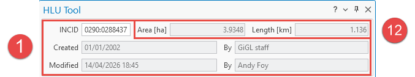

	User Interface INCID Fields

.. _figUIHaTF:

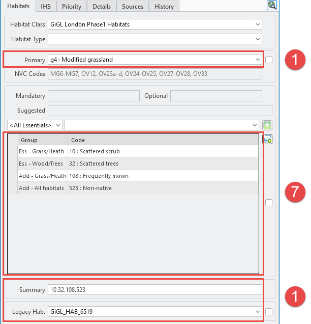

	User Interface Habitats Tab Fields

.. _figUIITF:

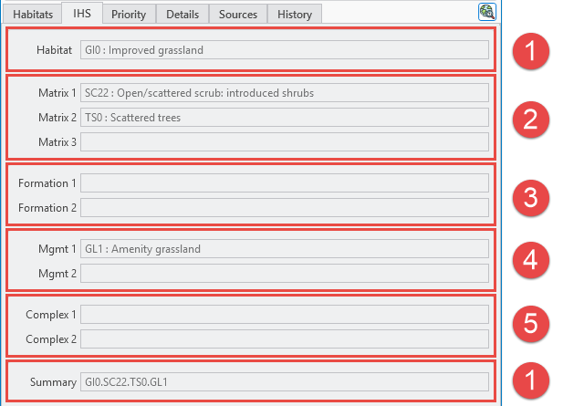

	User Interface IHS Tab Fields

.. _figUIPTF:

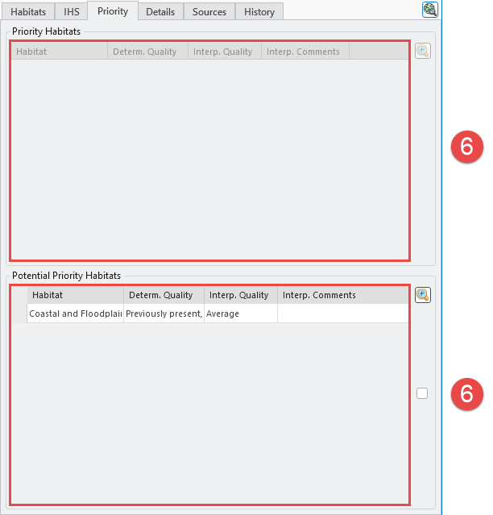

	User Interface Priority Tab Fields

.. _figUIDTF:

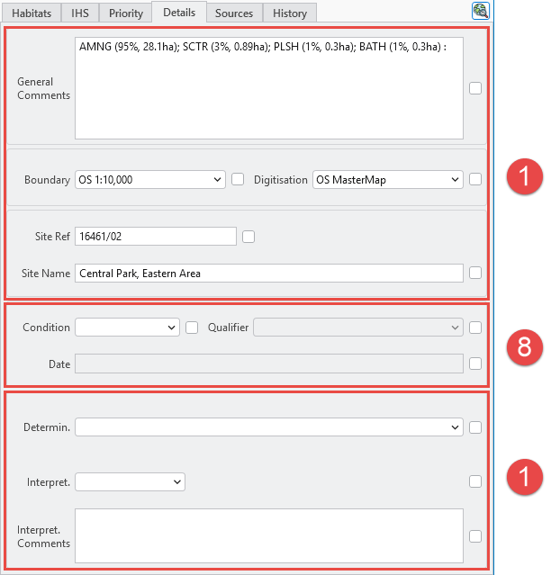

	User Interface Details Tab Fields

.. _figUISTF:

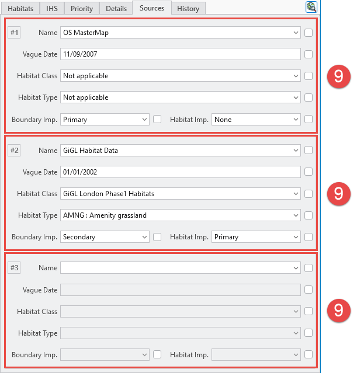

	User Interface Sources Tab Fields

.. _figUIOUF:

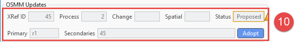

	User Interface OSMM Updates Fields

.. _figUIHiTF:

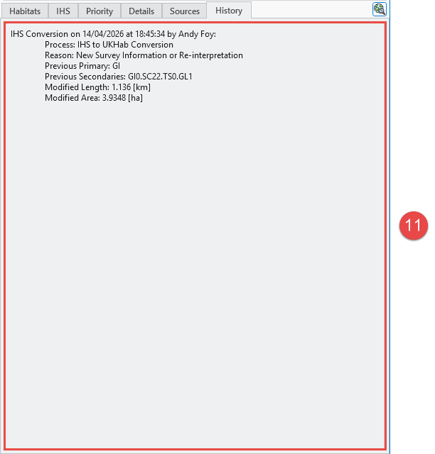

	User Interface History Tab Fields

.. raw:: latex

	\newpage

.. index::
	single: Data Table Descriptions

Data Table Descriptions
-----------------------

.. index::
	single: Data Tables; incid

.. _incid_table:

**incid**

This is the main data table with one record per INCID. All the other data tables relate to this table via the **INCID** field.

.. list-table:: incid fields
    :header-rows: 1
    :stub-columns: 1
    :widths: 24 10 50

    * - column
      - data type
      - description
    * - incid
      - Char(12)
      - A unique **Inc**\ remental **id**\ entifier for each logical group of features.
    * - legacy_habitat
      - Char(50)
      - Foreign key to ``code`` in the ``lut_legacy_habitat`` table representing the legacy Habitat for the INCID.
    * - ihs_habitat
      - Char(8)
      - Foreign key to ``code`` in the ``lut_ihs_habitat`` table representing the pre-conversion IHS Habitat for the INCID.
    * - ihs_summary
      - Char(254)
      - A read-only field containing a concatenated list of the IHS habitat details (habitat, matrix, formation, management, complex codes) for the INCID. This field is automatically maintained by the tool and should not be edited directly.
    * - site_ref
      - Char(16)
      - A free-text field containing a reference for the location of the feature.
    * - site_name
      - Char(100)
      - A free-text field containing a name for the location of the feature.
    * - boundary_base_map
      - Char(2)
      - Foreign key to ``Code`` column in the ``lut_boundary_map`` table representing the data map used to identify the feature boundary.
    * - digitisation_base_map
      - Char(2)
      - Foreign key to ``Code`` column in the ``lut_boundary_map`` table representing the data map used to digitise the feature boundary.
    * - general_comments
      - Char(254)
      - A free-text field containing any general comments relating to the INCID.
    * - habitat_class
      - Char(5)
      - Foreign key to ``code`` in the ``lut_habitat_class`` table storing the habitat classification of the primary habitat used when the primary habitat was last updated.
    * - habitat_version
      - Char(11)
      - The version of the primary habitat classification system used when the INCID attributes were last updated.
    * - habitat_primary
      - Char(8)
      - Foreign key to ``code`` in the ``lut_primary`` table representing the main primary habitat code for the INCID.
    * - habitat_secondaries
      - Char(80)
      - A concatenated list of the secondary habitat codes for the INCID.
    * - quality_determination
      - Char(2)
      - Foreign key to ``code`` in the ``lut_quality_determination`` table representing the accuracy with which the primary and secondary habitats of the INCID have been determined.
    * - quality_interpretation
      - Char(2)
      - Foreign key to ``code`` in the ``lut_quality_interpretation`` table representing how well the primary and secondary habitats of the INCID were interpreted from the source data.
    * - created_date
      - DateTime
      - The date and time that the INCID was first created (during the initial framework conversion, when the INCID was registered, or following a logical split).
    * - created_user_id
      - Char(40)
      - Foreign key to ``user_id`` in the ``lut_user`` table representing the user that created the INCID.
    * - last_modified_date
      - DateTime
      - The date and time that the INCID was last modified.
    * - last_modified_user_id
      - Char(40)
      - Foreign key to ``user_id`` in the ``lut_user`` table representing the user that last modified the INCID attributes or split or merged the INCID.

.. note::
	The ihs_habitat and ihs_summary fields are no longer maintained by the tool, but is retained in the database for legacy purposes. However, they may be cleared during updates or bulk updates depending upon the application options.

.. index::
	single: Data Tables; incid_ihs_matrix

.. _incid_ihs_matrix:

### incid_ihs_matrix

This table contains any IHS Matrix codes recorded alongside an IHS Habitat code to refine the habitat definition for an INCID. There can be between 0 and 3 records for each INCID.

.. list-table:: incid_ihs_matrix fields
    :header-rows: 1
    :stub-columns: 1
    :widths: 15 10 50

    * - column
      - data type
      - description
    * - matrix_id
      - Integer
      - A unique ID for each record.
    * - incid
      - Char(12)
      - Foreign key to ``incid`` in the ``incid`` table.
    * - matrix
      - Char(8)
      - Foreign key to ``code`` in the ``lut_ihs_matrix`` table representing an IHS Matrix type.

.. note::
	These codes are no longer maintained by the tool, but are retained in the database for legacy purposes. However, they may be cleared during updates or bulk updates depending upon the application options.

.. index::
	single: Data Tables; incid_ihs_formation

.. _incid_ihs_formation:

### incid_ihs_formation

This table contains any IHS Formation codes recorded alongside an IHS Habitat code to refine the habitat definition for an INCID. There can be between 0 and 2 records for each INCID.

.. list-table:: incid_ihs_formation fields
    :header-rows: 1
    :stub-columns: 1
    :widths: 15 10 50

    * - column
      - data type
      - description
    * - formation_id
      - Integer
      - A unique ID for each record.
    * - incid
      - Char(12)
      - Foreign key to ``incid`` in the ``incid`` table.
    * - formation
      - Char(8)
      - Foreign key to ``code`` in the ``lut_ihs_formation`` table representing an IHS Formation type.

.. note::
	These codes are no longer maintained by the tool, but are retained in the database for legacy purposes. However, they may be cleared during updates or bulk updates depending upon the application options.

.. index::
	single: Data Tables; incid_ihs_management

.. _incid_ihs_management:

### incid_ihs_management

This table contains any IHS Management codes recorded alongside an IHS Habitat code to refine the habitat definition for an INCID. There can be between 0 and 2 records for each INCID.

.. list-table:: incid_ihs_management fields
    :header-rows: 1
    :stub-columns: 1
    :widths: 15 10 50

    * - column
      - data type
      - description
    * - management_id
      - Integer
      - A unique ID for each record.
    * - incid
      - Char(12)
      - Foreign key to ``incid`` in the ``incid`` table.
    * - management
      - Char(8)
      - Foreign key to ``code`` in the ``lut_ihs_management`` table representing an IHS Management type.

.. note::
	These codes are no longer maintained by the tool, but are retained in the database for legacy purposes. However, they may be cleared during updates or bulk updates depending upon the application options.

.. index::
	single: Data Tables; incid_ihs_complex

.. _incid_ihs_complex:

### incid_ihs_complex

This table contains any IHS Complex codes recorded alongside an IHS Habitat code to refine the habitat definition for an INCID. There can be between 0 and 2 records for each INCID.

.. list-table:: incid_ihs_complex fields
    :header-rows: 1
    :stub-columns: 1
    :widths: 15 10 50

    * - column
      - data type
      - description
    * - complex_id
      - Integer
      - A unique ID for each record.
    * - incid
      - Char(12)
      - Foreign key to ``incid`` in the ``incid`` table.
    * - complex
      - Char(8)
      - Foreign key to ``code`` in the ``lut_ihs_complex`` table representing an IHS Complex type.

.. note::
	These codes are no longer maintained by the tool, but are retained in the database for legacy purposes. However, they may be cleared during updates or bulk updates depending upon the application options.

.. index::
	single: Data Tables; incid_bap

.. _incid_bap_table:

### incid_bap

This table contains details of the priority habitats and potential priority habitats for an INCID. There can be any number of each for each INCID.

.. list-table:: incid_bap fields
    :header-rows: 1
    :stub-columns: 1
    :widths: 22 10 50

    * - column
      - data type
      - description
    * - bap_id
      - Integer
      - A unique ID for each record.
    * - incid
      - Char(12)
      - Foreign key to ``incid`` in the ``incid`` table.
    * - bap_habitat
      - Char(11)
      - Foreign key to ``code`` in the ``lut_habitat_type`` table representing a priority habitat (or potential priority habitat).
    * - quality_determination
      - Char(2)
      - Foreign key to ``code`` in the ``lut_bap_quality_determination`` table representing the accuracy with which the priority habitat has been determined.
    * - quality_interpretation
      - Char(2)
      - Foreign key to ``code`` in the ``lut_bap_quality_interpretation`` table representing how well the priority habitat was interpreted from the source data.
    * - interpretation_comments
      - Char(254)
      - A free-text field containing any comments to explain the reasoning behind the priority habitat determination and interpretation.
	  :widths: 20 10 50

.. index::
	single: Data Tables; incid_condition

.. _incid_condition_table:

### incid_condition

This table contains details of the condition assessments for an INCID. There can be any number of condition assessments for each INCID, but only the most recent assessment will be displayed in the 'Details' tab of the dockpane.

.. list-table:: incid_condition fields
    :header-rows: 1
    :stub-columns: 1
    :widths: 20 10 50

    * - column
      - data type
      - description
    * - incid_condition_id
      - Integer
      - A unique ID for each record.
    * - incid
      - Char(12)
      - Foreign key to ``incid`` in the ``incid`` table.
    * - condition
      - Char(2)
      - Foreign key to ``code`` in the ``lut_condition`` table representing the condition of the habitat.
    * - condition_qualifier
      - Char(2)
      - Foreign key to ``code`` in the ``lut_condition_qualifier`` table representing how the condition of the data was measured.
    * - condition_date_start
      - Integer
      - Start date of the data range covered by the condition assessment represented, as the number of days since 01/01/1900.
    * - condition_date_end
      - Integer
      - End date of the data range covered by the condition assessment, represented as the number of days since 01/01/1900.
    * - condition_date_type
      - Char(2)
      - String that describes the format of the date range covering the condition assessment.

.. index::
	single: Data Tables; incid_secondary

.. _incid_secondary_table:

### incid_secondary

This table contains any secondary habitat codes recorded alongside the primary habitat code to refine the habitat definition for an INCID. There can be any number of secondary habitat records for each INCID.

.. list-table:: incid_secondary fields
    :header-rows: 1
    :stub-columns: 1
    :widths: 20 10 50

    * - column
      - data type
      - description
    * - secondary_id
      - Integer
      - A unique ID for each record.
    * - incid
      - Char(12)
      - Foreign key to ``incid`` in the ``incid`` table.
    * - secondary_habitat
      - Char(8)
      - Foreign key to ``code`` in the ``lut_secondary`` table representing a secondary habitat code.
    * - secondary_group
      - Char(2)
      - Foreign key to ``code`` in the ``lut_secondary_group`` table representing the group the secondary habitat code belongs to.

.. index::
	single: Data Tables; incid_sources

.. _incid_sources:

### incid_sources

This table contains details of the source datasets for an INCID. There can be between 0 and 3 records for each INCID.

.. list-table:: incid_sources fields
    :header-rows: 1
    :stub-columns: 1
    :widths: 24 10 50

    * - column
      - data type
      - description
    * - incid_source_id
      - Integer
      - A unique ID for each record.
    * - incid
      - Char(12)
      - Foreign key to ``incid`` in the ``incid`` table.
    * - source_id
      - Integer
      - Foreign key to ``source_id`` in the ``lut_sources`` table representing a source dataset.
    * - source_date_start
      - Integer
      - Start date of the data range covered by the source dataset represented as the number of days since 01/01/1900.
    * - source_date_end
      - Integer
      - End date of the data range covered by the source dataset represented as the number of days since 01/01/1900.
    * - source_date_type
      - Char(2)
      - String that describes the format of the date range covering the source dataset.
    * - source_habitat_class
      - Char(5)
      - Foreign key to ``code`` in the ``lut_habitat_class`` table representing the habitat classification of the source dataset.
    * - source_habitat_type
      - Char(11)
      - Foreign key to ``code`` in the ``lut_habitat_type`` table representing the habitat type of the source dataset.
    * - source_boundary_importance
      - Char(1)
      - Foreign key to ``code`` in the ``lut_important`` table representing the relative importance of the source when determining the boundary location of all the features in the INCID.
    * - source_habitat_importance
      - Char(1)
      - Foreign key to ``code`` in the ``lut_important`` table representing the relative importance of the source when determining the IHS Habitat and associated multiplex codes of the INCID.
    * - sort_order
      - Integer
      - Determines the (ascending) order the sources for each INCID will be displayed in the 'Sources' tab of the dockpane.

.. tabularcolumns:: |L|L|L|

.. table:: Vague date types

	+-----------+-------------------------------+---------------------------+
	| Date Type |          Description          |          Example          |
	+===========+===============================+===========================+
	| D         | Single day date               | 15/10/2010                |
	+-----------+-------------------------------+---------------------------+
	| DD        | Day-to-date date range        | 15/10/2010 - 18/10/2010   |
	+-----------+-------------------------------+---------------------------+
	| D-        | Day start with no end date    | 15/10/2010 -              |
	+-----------+-------------------------------+---------------------------+
	| -D        | Day end with no start date    | \- 18/10/2010             |
	+-----------+-------------------------------+---------------------------+
	| O         | Single month date             | Oct 2010                  |
	+-----------+-------------------------------+---------------------------+
	| OO        | Month-to-month date range     | Oct 2010 - Nov 2010       |
	+-----------+-------------------------------+---------------------------+
	| O-        | Month start with no end date  | Oct 2010 -                |
	+-----------+-------------------------------+---------------------------+
	| -O        | Month end with no start date  | \- Nov 2010               |
	+-----------+-------------------------------+---------------------------+
	| Y         | Single year date              | 2010                      |
	+-----------+-------------------------------+---------------------------+
	| YY        | Year-to-year date range       | 2010 - 2011               |
	+-----------+-------------------------------+---------------------------+
	| Y-        | Year start with no end date   | 2010 -                    |
	+-----------+-------------------------------+---------------------------+
	| -Y        | Year end with no start date   | \- 2011                   |
	+-----------+-------------------------------+---------------------------+
	| P         | Single season date            | Autumn 2010               |
	+-----------+-------------------------------+---------------------------+
	| PP        | Season-to-season date range   | Autumn 2010 - Winter 2010 |
	+-----------+-------------------------------+---------------------------+
	| P-        | Season start with no end date | Autumn 2010 -             |
	+-----------+-------------------------------+---------------------------+
	| -P        | Season end with no start date | \- Winter 2010            |
	+-----------+-------------------------------+---------------------------+
	| U         | Unknown date                  | Unknown                   |
	+-----------+-------------------------------+---------------------------+

.. index::
	single: Data Tables; incid_osmm_update

.. _incid_osmm_update_table:

### incid_osmm_update

This table contains details of any proposed Ordnance Survey MasterMap (OSMM) updates for an INCID. There will only be OSMM update records if the habitat framework has been externally processed to integrate more recent OSMM data. Any proposed updates based on the new OSMM data will be loaded into this table.

.. list-table:: incid_osmm_update fields
    :header-rows: 1
    :stub-columns: 1
    :widths: 22 10 50

    * - column
      - data type
      - description
    * - incid_osmm_update_id
      - Integer
      - A unique ID for each proposed update.
    * - incid
      - Char(12)
      - Foreign key to ``incid`` in the ``incid`` table.
    * - osmm_xref_id
      - Integer
      - Foreign key to ``osmm_xref_id`` in the ``lut_osmm_habitat_xref`` table representing a unique set of OS MasterMap attributes.
    * - spatial_flag
      - Char(1)
      - Indicates whether part of the new feature has been changed compared to the original framework.
    * - process_flag
      - Integer
      - Indicates which step in the external OSMM Update process the proposed update was determined.
    * - change_flag
      - Char(1)
      - Indicate whether the proposed primary habitat is the same as the original primary habitat and whether it is a higher or lower level in the habitat hierarchy.
    * - status
      - Integer
      - Indicates the current status of the proposed OSMM Update (proposed, pending, applied, ignored or rejected).
    * - created_date
      - DateTime
      - The date and time that the proposed update was first created (when the framework was externally processed to integrate more recent OSMM data).
    * - created_user_id
      - Char(40)
      - Foreign key to ``user_id`` in the ``lut_user`` table representing the user that created the proposed update.
    * - last_modified_date
      - DateTime
      - The date and time that the proposed update was last modified.
    * - last_modified_user_id
      - Char(40)
      - Foreign key to ``user_id`` in the ``lut_user`` table representing the user that last modified the proposed update by skipping, accepting, rejecting or ignoring it.

.. index::
	single: Data Tables; history

.. _history:

### history

This table contains a record of **every** change to **every** feature made using the HLU Tool.

.. list-table:: history fields
    :header-rows: 1
    :stub-columns: 1
    :widths: 22 10 50

    * - column
      - data type
      - description
    * - history_id
      - Integer
      - A unique ID for each record.
    * - incid
      - Char(12)
      - Foreign key to ``incid`` in the ``incid`` table.
    * - toid
      - Char(20)
      - The unique Ordnance Survey **to**\ pographical **id**\ entifier of each feature.
    * - toid_fragment_id
      - Char(5)
      - An incremental number (prefixed with zeros) used as a unique reference for each fragment of an INCID.
    * - modified_user_id
      - Char(40)
      - Foreign key to ``user_id`` in the ``lut_user`` table representing the user that modified the feature.
    * - modified_date
      - DateTime
      - The date and time that the features was modified.
    * - modified_process
      - Char(3)
      - Foreign key to ``code`` in the ``lut_process`` table representing the activity being undertaken when the feature was modified.
    * - modified_reason
      - Char(3)
      - Foreign key to ``code`` in the ``lut_reason`` table representing the underlying explanation for the change to the feature.
    * - modified_habprimary
      - Char(8)
      - Foreign key to ``code`` in the ``lut_primary`` table representing the primary habitat code prior to the changes to the feature.
    * - modified_habsecond
      - Char(80)
      - A concatenation list of the secondary codes from the INCID for this feature prior to the changes to the feature.
    * - modified_operation
      - Char(3)
      - Foreign key to ``code`` in the ``lut_operation`` table representing the operation that undertaken to cause the change to the feature.
    * - modified_incid
      - Char(12)
      - The incid prior to the changes to the feature. In the event of a logical split or logical merge this value will be different to the current **incid**, otherwise it will be the same as the current **incid**.
    * - modified_fragid
      - Char(5)
      - The fragid prior to the changes to the feature. In the event of a physical split or logical merge this value will be different to the current **fragid**, otherwise it will be the same as the current **fragid**.
    * - modified_length
      - Float
      - A decimal value of variable precision representing the perimeter length of the feature after the changes to the feature.
    * - modified_area
      - Float
      - A decimal value of variable precision representing the spatial area of the feature after the changes to the feature.
    * - modified_determinqty
      - Char(2)
      - Foreign key to ``code`` in the ``lut_quality_determination`` table representing the accuracy with which the primary and secondary habitats of the INCID for this feature have been determined prior to the changes to the feature.
    * - modified_interpqty
      - Char(2)
      - Foreign key to ``code`` in the ``lut_quality_interpretation`` table representing how well the primary and secondary habitats of the INCID for this feature were interpreted from the source data prior to the changes to the feature.

.. index::
	single: Data Tables; incid_mm_polygons

.. _incid_mm_polygons:

### incid_mm_polygons

This table is a local database **copy** of the attribute table for the HLU polygon feature layers. It is used to improve performance for the tool. If the HLU polygon features are split into mulitple layers this table contains the attribute records for **all** those layers combined. There can be any number of records for each INCID, depending upon how many INCID fragments are associated with the INCID.

.. list-table:: incid_mm_polygons fields
    :header-rows: 1
    :stub-columns: 1
    :widths: 15 10 50

    * - column
      - data type
      - description
    * - incid
      - Char(12)
      - Foreign key to ``incid`` in the ``incid`` table.
    * - toid
      - Char(20)
      - The unique Ordnance Survey **to**\ pographical **id**\ entifier of each feature.
    * - fragid
      - Char(5)
      - An incremental number (prefixed with zeros) used as a unique reference for each fragment in the INCID.
    * - habprimary
      - Char(8)
      - Foreign key to ``code`` in the ``lut_primary`` table representing the primary habitat code.
    * - habsecond
      - Char(80)
      - A concatenation list of the secondary codes from the INCID for this feature. This field is automatically maintained by the tool.
    * - determqty
      - Char(2)
      - Foreign key to ``code`` in the ``lut_quality_determination`` table representing the accuracy with which the primary and secondary habitats of the INCID for this feature have been determined.
    * - interpqty
      - Char(2)
      - Foreign key to ``code`` in the ``lut_quality_interpretation`` table representing how well the primary and secondary habitats of the INCID for this feature were interpreted from the source data.
    * - shape_length
      - Float
      - A decimal value of variable precision representing the perimeter length of the feature.
    * - shape_area
      - Float
      - A decimal value of variable precision representing the spatial area of the feature.

.. index::
	single: Data Tables; incid_mm_lines

.. _incid_mm_lines:

### incid_mm_lines

This table is a local database **copy** of the attribute table for the HLU polyline feature layers. It is used to improve performance for the tool. It has the same structure as the **incid_mm_polygons** table but is used when the HLU GIS layer contains polyline features instead of polygons.

.. list-table:: incid_mm_lines fields
    :header-rows: 1
    :stub-columns: 1
    :widths: 15 10 50

    * - column
      - data type
      - description
    * - incid
      - Char(12)
      - Foreign key to ``incid`` in the ``incid`` table.
    * - toid
      - Char(20)
      - The unique Ordnance Survey **to**\ pographical **id**\ entifier of each feature.
    * - fragid
      - Char(5)
      - An incremental number (prefixed with zeros) used as a unique reference for each fragment in the INCID.
    * - habprimary
      - Char(8)
      - Foreign key to ``code`` in the ``lut_primary`` table representing the primary habitat code.
    * - habsecond
      - Char(80)
      - A concatenation list of the secondary codes from the INCID for this feature. This field is automatically maintained by the tool.
    * - determqty
      - Char(2)
      - Foreign key to ``code`` in the ``lut_quality_determination`` table representing the accuracy with which the primary and secondary habitats of the INCID for this feature have been determined.
    * - interpqty
      - Char(2)
      - Foreign key to ``code`` in the ``lut_quality_interpretation`` table representing how well the primary and secondary habitats of the INCID for this feature were interpreted from the source data.
    * - shape_length
      - Float
      - A decimal value of variable precision representing the length of the polyline feature.

.. note::
	Polyline features do not have an area, therefore the **shape_area** attribute is not included in this table.

.. index::
	single: Data Tables; incid_mm_points

.. _incid_mm_points:

### incid_mm_points

This table is a local database **copy** of the attribute table for the HLU point feature layers. It is used to improve performance for the tool. It has the same structure as the **incid_mm_polygons** table but is used when the HLU GIS layer contains point features instead of polygons.

.. list-table:: incid_mm_points fields
    :header-rows: 1
    :stub-columns: 1
    :widths: 15 10 50

    * - column
      - data type
      - description
    * - incid
      - Char(12)
      - Foreign key to ``incid`` in the ``incid`` table.
    * - toid
      - Char(20)
      - The unique Ordnance Survey **to**\ pographical **id**\ entifier of each feature.
    * - fragid
      - Char(5)
      - An incremental number (prefixed with zeros) used as a unique reference for each fragment in the INCID.
    * - habprimary
      - Char(8)
      - Foreign key to ``code`` in the ``lut_primary`` table representing the primary habitat code.
    * - habsecond
      - Char(80)
      - A concatenation list of the secondary codes from the INCID for this feature. This field is automatically maintained by the tool.
    * - determqty
      - Char(2)
      - Foreign key to ``code`` in the ``lut_quality_determination`` table representing the accuracy with which the primary and secondary habitats of the INCID for this feature have been determined.
    * - interpqty
      - Char(2)
      - Foreign key to ``code`` in the ``lut_quality_interpretation`` table representing how well the primary and secondary habitats of the INCID for this feature were interpreted from the source data.

.. note::
	Point features do not have a length or area, therefore the **shape_length** and **shape_area** attributes are not included in this table.

.. raw:: latex

	\newpage

.. index::
	single: Lookup Tables

.. _lookup_tables:

Lookup Tables
=============

Tables in the database prefixed by ``lut\_`` are **lookup** tables and are used in many drop-down lists in the user interfaces to restrict choices to only valid or appropriate values for the organisation.

**Key to Lookup Tables**

1. lut_boundary_map
2. lut_condition
3. lut_condition_qualifier
4. lut_habitat_class
5. lut_habitat_type
6. lut_habitat_type_primary
7. lut_habitat_type_secondary
8. lut_ihs_complex
9. lut_ihs_formation
10. lut_ihs_habitat
11. lut_ihs_management
12. lut_ihs_matrix
13. lut_importance
14. lut_last_incid
15. lut_legacy_habitat
16. lut_operation
17. lut_osmm_habitat_xref
18. lut_osmm_updates_change
19. lut_osmm_updates_process
20. lut_osmm_updates_spatial
21. lut_primary
22. lut_primary_bap_habitat
23. lut_primary_category
24. lut_primary_secondary
25. lut_process
26. lut_quality_determination
27. lut_quality_interpretation
28. lut_reason
29. lut_secondary
30. lut_secondary_bap_habitat
31. lut_secondary_group
32. lut_site_id
33. lut_sources
34. lut_user
35. lut_version

.. note::

	* Changes to the lookup tables won't take effect for HLU Tool instances that are running. ArcGIS Pro will need to be closed and re-started to ensure the changes take effect.
	* Lookup table values are relevant to the **whole** database system and hence any changes will affect **all** users of that database.
	* **All** records in tables containing a ``sort_order`` attribute must have a numerical value set or they may not appear in the relevant drop-down lists.

.. seealso::
	See :Ref:`configuring_luts` for more information on configuring lookup tables.

There are three types of lookup tables in the HLU Tool database:

	1. System lookup tables
	2. Local lookup tables
	3. User lookup tables

.. raw:: latex

	\newpage

.. index::
	single: Lookup Tables; System

.. _lookup_tables_system:

System lookup tables
--------------------

These tables contain records and settings that are generic to all HLU Tool installations. Changes to these tables should **only** ever be made under the guidance of the system developer.

lut_boundary_map
	Contains the list of map types that can be assigned to the 'Boundary Map' and 'Digitisation Map' fields on the 'Details' tab of the dockpane.

lut_ihs_complex
	Contains all the IHS Complex codes that can be assigned using the 'Complex' fields on the 'Habitats' tab of the dockpane.

lut_ihs_formation
	Contains all the IHS Formation codes that can be assigned using the 'Formation' fields on the 'Habitats' tab of the dockpane.

lut_ihs_habitat
	Contains all the IHS Habitats that can be assigned to INCIDs using the 'Habitat' field on the 'Habitats' tab of the dockpane.

lut_ihs_management
	Contains all the IHS Management codes that can be assigned using the 'Management' fields on the 'Habitats' tab of the dockpane.

lut_ihs_matrix
	Contains all the IHS Matrix codes that can be assigned using the 'Matrix' fields on the 'Habitats' tab of the dockpane.

lut_importance
	Contains the difference levels of Importance that can be assigned to Sources using the 'Boundary Imp.' and 'Habitat Imp.' fields on the 'Sources' tab of the dockpane.

lut_last_incid
	Contains the last INCID number that was assigned to a feature when the HLU Tool. This is used to determine the next INCID number to assign when creating a new feature. It applies to all feature types (polygon, polyline and point) and is used to ensure that INCIDs are unique across all feature types.

lut_operation
	Contains the operation types that are assigned to history records when a feature is modified, split, merged or inserted. The operation types are used to record the type of change that was made to a feature and are displayed in the 'Operation' field on the 'History' tab of the dockpane.

lut_osmm_updates_change
	Contains the change types that are assigned to proposed OSMM updates when the habitat framework has been externally processed to integrate more recent OSMM data. The change types are used to record whether the proposed primary habitat is the same as the original primary habitat and whether it is a higher or lower level in the habitat hierarchy.

lut_osmm_updates_process
	Contains the process types that are assigned to proposed OSMM updates when the habitat framework has been externally processed to integrate more recent OSMM data. The process types are used to record the type of change to the primary habitat, and the number of sources assigned, to the original INCID.

lut_osmm_updates_spatial
	Contains the spatial types that are assigned to proposed OSMM updates when the habitat framework has been externally processed to integrate more recent OSMM data. The spatial types are used to record whether part of the new feature has been spatially changed compared to the original framework. An ‘X’ denotes when a feature overlaps two or more features in the original framework, and so a portion of the new feature may now be assigned to a different INCID than it was originally.

lut_primary_bap_habitat
	Contains the mapping between primary habitats and priority habitats. It controls which priority habitats are automatically assigned to INCIDs on the 'Priority' tab of the dockpane based on the selected 'Primary' habitat on the 'Habitats' tab.

lut_quality_determination
	Contains the determination quality types that can be assigned to INCIDs on the 'Details tab of the dockpane, and to individual 'Priority Habitats' and 'Potential Priority Habitats' on the 'Priority' tab of the dockpane.

lut_quality_interpretation
	Contains the interpretation quality types that can be assigned to INCIDs on the 'Details tab of the dockpane, and to individual 'Priority Habitats' and 'Potential Priority Habitats' on the 'Priority' tab of the dockpane.

lut_reason
	Contains details of all the reasons that can be referenced in the 'Reason' field on the HLU Tool ribbon to indicate the activity being undertaken when using the HLU Tool.

lut_secondary_bap_habitat
	Contains the mapping between secondary habitats and priority habitats. It controls which priority habitats are automatically assigned to INCIDs on the 'Priority' tab of the dockpane based on the selected 'Secondary' habitats on the 'Habitats' tab.

lut_site_id
	Contains the unique site identifiers that are assigned to new INCIDs when new features are created. Different site identifiers are used for polygon, line and point features, and must be unique across all HLU Tool installations.

lut_version
	Contains the minimum application and database version numbers that are required to connect to this database instance, and the current data version. These are used to ensure that the correct version of the HLU Tool is being used with the database. The ``data_version`` attribute is used to indicated whether the database contains 'Live' or 'Test' data, and appears on the 'About' dialog in the HLU Tool.

	.. caution::
		The ``data_version`` attribute indicates whether the database contains 'Live' or 'Test' data, and hence should be changed whenever a database is copied from a 'Live' environment to a 'Test' environment, or vice versa.

.. raw:: latex

	\newpage

.. index::
	single: Lookup Tables; Local

.. _lookup_tables_local:

Local lookup tables
-------------------

These tables also contain records and settings that are generic to all HLU Tool installations. However, they can be configured for a given HLU Tool installation, by setting the **is_local** attribute to 'True' or 'False', so that they are either used or ignored by the HLU Tool.

	* lut_condition
	* lut_condition_qualifier
	* lut_habitat_class
	* lut_habitat_type
	* lut_habitat_type_primary
	* lut_habitat_type_secondary
	* lut_primary
	* lut_primary_category
	* lut_primary_secondary
	* lut_secondary
	* lut_secondary_group

.. seealso::
	See :ref:`configuring_luts` for more information on configuring lookup tables.

.. index::
	single: Lookup Tables; lut_condition

.. _lut_condition:

### lut_condition

This table contains details of all the condition assessment levels (e.g. Good, Fairly Good, Moderate, etc.) that can be referenced by an INCID. The codes appear in the 'Condition' drop-down list on the 'Details' tab.

.. list-table:: lut_condition fields
    :header-rows: 1
    :stub-columns: 1
    :widths: 12 50

    * - column
      - description
    * - code
      - A unique identifier for each condition. Referenced by ``condition`` in ``incid_condition``.
    * - description
      - A brief name or description that will appear in the 'Condition' drop-down list on the 'Details' tab.
    * - is_local
      - Set to 'True' (minus 1) to include in drop-down lists, or 'False' (zero) to exclude.
    * - sort_order
      - Determines the order conditions are displayed in the 'Condition' drop-down list on the 'Details' tab.
    * - added_by
      - Foreign key to ``user_id`` in the ``lut_user`` table representing the user that added this record to the database.
    * - added_date
      - The date and time that this record was added to the database.
    * - modified_by
      - Foreign key to ``user_id`` in the ``lut_user`` table representing the user that last modified this record in the database.
    * - modified_date
      - The date and time that this record was last modified in the database.
    * - system_supplied
      - Set to 'True' (minus 1) if this record was supplied by the system, or 'False' (zero) if it was added by a user.
    * - custodian
      - Not used. This attribute is reserved for future use to indicate the organisation that is responsible for maintaining this record in the database.

.. index::
	single: Lookup Tables; lut_condition_qualifier

.. _lut_condition_qualifier:

### lut_condition_qualifier

This table contains all of the condition assessment methods (e.g. Defra metric assessment, Rapid assessment, etc.) that can be used to qualify the condition of the habitat. The codes appear in the 'Condition Qualifier' drop-down list on the 'Details' tab.

.. list-table:: lut_condition_qualifier fields
    :header-rows: 1
    :stub-columns: 1
    :widths: 12 50

    * - column
      - description
    * - code
      - A unique identifier for each condition qualifier. Referenced by ``condition_qualifier`` in ``incid_condition``.
    * - description
      - A brief name or description that will appear in the 'Condition Qualifier' drop-down list on the 'Details' tab.
    * - is_local
      - Set to 'True' (minus 1) to include in drop-down lists, or 'False' (zero) to exclude.
    * - sort_order
      - Determines the order condition qualifiers are displayed in the 'Condition Qualifier' drop-down list on the 'Details' tab.
    * - added_by
      - Foreign key to ``user_id`` in the ``lut_user`` table representing the user that added this record to the database.
    * - added_date
      - The date and time that this record was added to the database.
    * - modified_by
      - Foreign key to ``user_id`` in the ``lut_user`` table representing the user that last modified this record in the database.
    * - modified_date
      - The date and time that this record was last modified in the database.
    * - system_supplied
      - Set to 'True' (minus 1) if this record was supplied by the system, or 'False' (zero) if it was added by a user.
    * - custodian
      - Not used. This attribute is reserved for future use to indicate the organisation that is responsible for maintaining this record in the database.

.. index::
	single: Lookup Tables; lut_habitat_class

.. _lut_habitat_class:

### lut_habitat_class

This table contains all of the habitat classification systems (e.g. UKHab, Phase 1, IHS, NVC) that appear in the 'Class' drop-down list on the 'Habitats' tab and the 'Habitat Class' drop-down list on the 'Sources' tab. It is used to filter the primary habitat code selection on the 'Habitats' tab of the dockpane. See :ref:`configuring_habitat_class` for more details.

.. list-table:: lut_habitat_class fields
    :header-rows: 1
    :stub-columns: 1
    :widths: 15 50

    * - column
      - description
    * - code
      - A unique identifier for each habitat classification. Referenced by ``habitat_class_code`` in ``lut_habitat_type`` and in ``lut_primary``.
    * - description
      - A brief name or description that will appear in the 'Class' drop-down list on the 'Habitats' tab and the 'Habitat Class' drop-down list on the 'Sources' tab.
    * - habitat_version
      - The version string for this habitat classification (e.g. '1.0'). Returned by the tool when recording which classification version was active at the time of an update.
    * - is_local
      - Set to 'True' (minus 1) to include in drop-down lists, or 'False' (zero) to exclude.
    * - sort_order
      - Determines the order habitat classifications are displayed in the 'Class' drop-down list on the 'Habitats' tab.
    * - added_by
      - Foreign key to ``user_id`` in the ``lut_user`` table representing the user that added this record to the database.
    * - added_date
      - The date and time that this record was added to the database.
    * - modified_by
      - Foreign key to ``user_id`` in the ``lut_user`` table representing the user that last modified this record in the database.
    * - modified_date
      - The date and time that this record was last modified in the database.
    * - system_supplied
      - Set to 'True' (minus 1) if this record was supplied by the system, or 'False' (zero) if it was added by a user.
    * - custodian
      - Not used. This attribute is reserved for future use to indicate the organisation that is responsible for maintaining this record in the database.

.. index::
	single: Lookup Tables; lut_habitat_type

.. _lut_habitat_type:

### lut_habitat_type

This table contains all of the habitat types within each habitat classification that appear in the 'Type' drop-down list on the 'Habitats' tab (for the selected 'Class') and the 'Habitat Type' drop-down list on the 'Sources' tab. Selecting a type on the 'Habitats' tab filters the 'Primary' drop-down list to show only relevant primary habitat codes. See :ref:`configuring_habitat_type` for more details.

.. list-table:: lut_habitat_type fields
    :header-rows: 1
    :stub-columns: 1
    :widths: 20 50

    * - column
      - description
    * - code
      - A unique identifier for each habitat type. Referenced as ``code_habitat_type`` in ``lut_habitat_type_primary`` and in ``lut_habitat_type_secondary``.
    * - habitat_class_code
      - Foreign key to ``code`` in the ``lut_habitat_class`` table. Determines which classification system this type belongs to and hence which types appear when a given class is selected.
    * - name
      - A short name for the habitat type.
    * - description
      - A longer description that will appear in the 'Type' drop-down list on the 'Habitats' tab and the 'Habitat Type' drop-down list on the 'Sources' tab.
    * - bap_priority
      - Boolean. When set to 'True' (minus 1) this habitat type will also appear in the 'Priority habitat' drop-down lists on the 'Priority' tab.
    * - is_local
      - Set to 'True' (minus 1) to include in drop-down lists, or 'False' (zero) to exclude.
    * - sort_order
      - Determines the order habitat types are displayed in the 'Type' drop-down list on the 'Habitats' tab.
    * - added_by
      - Foreign key to ``user_id`` in the ``lut_user`` table representing the user that added this record to the database.
    * - added_date
      - The date and time that this record was added to the database.
    * - modified_by
      - Foreign key to ``user_id`` in the ``lut_user`` table representing the user that last modified this record in the database.
    * - modified_date
      - The date and time that this record was last modified in the database.
    * - system_supplied
      - Set to 'True' (minus 1) if this record was supplied by the system, or 'False' (zero) if it was added by a user.
    * - custodian
      - Not used. This attribute is reserved for future use to indicate the organisation that is responsible for maintaining this record in the database.

.. index::
	single: Lookup Tables; lut_habitat_type_primary

.. _lut_habitat_type_primary:

### lut_habitat_type_primary

This cross-reference table maps habitat types to their valid and preferred primary habitat codes, and their suggested secondary codes and habitat tips. It controls which primary codes appear in the 'Primary' drop-down list for a given habitat type, and whether a code is shown as 'preferred' (bold, above the divider line) or not.

.. list-table:: lut_habitat_type_primary fields
    :header-rows: 1
    :stub-columns: 1
    :widths: 20 50

    * - column
      - description
    * - code_habitat_type
      - Foreign key to ``code`` in the ``lut_habitat_type`` table.
    * - code_primary
      - Foreign key to ``code`` in the ``lut_primary`` table. Supports a trailing wildcard suffix (e.g. ``g1*``) to match all primary codes beginning with that prefix.
    * - preferred
      - When set to 'True' (minus 1) the primary code is displayed in **bold** above the separator line in the 'Primary' drop-down list for this habitat type.
    * - habitat_secondaries
      - A space- or comma-separated list of secondary habitat codes that are suggested for this habitat type and primary code combination. Displayed read-only in the 'Suggested' field on the 'Habitats' tab.
    * - comments
      - Free-text guidance notes for the selected habitat type and primary code combination. Displayed via the **Habitat Tips** info button on the 'Habitats' tab.
    * - is_local
      - Set to 'True' (minus 1) to include in drop-down lists, or 'False' (zero) to exclude.
    * - added_by
      - Foreign key to ``user_id`` in the ``lut_user`` table representing the user that added this record to the database.
    * - added_date
      - The date and time that this record was added to the database.
    * - modified_by
      - Foreign key to ``user_id`` in the ``lut_user`` table representing the user that last modified this record in the database.
    * - modified_date
      - The date and time that this record was last modified in the database.
    * - system_supplied
      - Set to 'True' (minus 1) if this record was supplied by the system, or 'False' (zero) if it was added by a user.
    * - custodian
      - Not used. This attribute is reserved for future use to indicate the organisation that is responsible for maintaining this record in the database.

.. index::
	single: Lookup Tables; lut_habitat_type_secondary

.. _lut_habitat_type_secondary:

### lut_habitat_type_secondary

This cross-reference table maps habitat types to their permitted secondary habitat codes, and flags whether each secondary code is mandatory or just optional for that habitat type. It populates the read-only 'Mandatory' and 'Optional' fields on the 'Habitats' tab.

.. list-table:: lut_habitat_type_secondary fields
    :header-rows: 1
    :stub-columns: 1
    :widths: 15 50

    * - column
      - description
    * - code_habitat_type
      - Foreign key to ``code`` in the ``lut_habitat_type`` table.
    * - code_secondary
      - Foreign key to ``code`` in the ``lut_secondary`` table.
    * - mandatory
      - Integer. Set to ``1`` if the secondary code is mandatory for the habitat type (displayed in the 'Mandatory' field and validated according to the **Habitat/Secondary Validation** setting in the Options). Set to ``0`` if the code is optional (displayed in the 'Optional' field).
    * - is_local
      - Set to 'True' (minus 1) to include in drop-down lists, or 'False' (zero) to exclude.
    * - added_by
      - Foreign key to ``user_id`` in the ``lut_user`` table representing the user that added this record to the database.
    * - added_date
      - The date and time that this record was added to the database.
    * - modified_by
      - Foreign key to ``user_id`` in the ``lut_user`` table representing the user that last modified this record in the database.
    * - modified_date
      - The date and time that this record was last modified in the database.
    * - system_supplied
      - Set to 'True' (minus 1) if this record was supplied by the system, or 'False' (zero) if it was added by a user.
    * - custodian
      - Not used. This attribute is reserved for future use to indicate the organisation that is responsible for maintaining this record in the database.

	.. note::
		Whether missing mandatory secondary codes are treated as warnings or errors is controlled by the **Habitat/Secondary Validation** option. See 'Validation Options' in the HLU Tool User Guide for details.

.. index::
	single: Lookup Tables; lut_primary

.. _lut_primary:

### lut_primary

This table contains all the primary habitat codes that can be assigned to an INCID. The codes that appear in the 'Primary' drop-down list on the 'Habitats' tab are determined by the selected habitat class and type via the ``lut_habitat_type_primary`` cross-reference table.

.. list-table:: lut_primary fields
    :header-rows: 1
    :stub-columns: 1
    :widths: 15 50

    * - column
      - description
    * - code
      - A unique identifier for each primary habitat code. Stored in ``habitat_primary`` in the ``incid`` table.
    * - description
      - A brief description that will appear in the 'Primary' drop-down list on the 'Habitats' tab.
    * - category
      - Foreign key to ``code`` in the ``lut_primary_category`` table. Only primary codes whose category has ``is_local`` set to True are included in drop-down lists.
    * - habitat_class_code
      - Foreign key to ``code`` in the ``lut_habitat_class`` table. Used by the tool to derive the habitat class and version for a given primary code.
    * - nvc_codes
      - [Optional]. A comma-separated list of NVC codes associated with this primary habitat code. Displayed read-only in the 'NVC Codes' field on the 'Habitats' tab when this primary code is selected.
    * - polygon
      - Set to 'True' (minus 1) if the primary habitat code is valid for polygon features.
    * - line
      - Set to 'True' (minus 1) if the primary habitat code is valid for line features.
    * - point
      - Set to 'True' (minus 1) if the primary habitat code is valid for point features.
    * - comments
      - Any user comments relating to the cross-referencing.
    * - is_local
      - Set to 'True' (minus 1) to include in drop-down lists, or 'False' (zero) to exclude.
    * - sort_order
      - Determines the order primary codes are displayed within the 'Primary' drop-down list.
    * - added_by
      - Foreign key to ``user_id`` in the ``lut_user`` table representing the user that added this record to the database.
    * - added_date
      - The date and time that this record was added to the database.
    * - modified_by
      - Foreign key to ``user_id`` in the ``lut_user`` table representing the user that last modified this record in the database.
    * - modified_date
      - The date and time that this record was last modified in the database.
    * - system_supplied
      - Set to 'True' (minus 1) if this record was supplied by the system, or 'False' (zero) if it was added by a user.
    * - custodian
      - Not used. This attribute is reserved for future use to indicate the organisation that is responsible for maintaining this record in the database.

.. index::
	single: Lookup Tables; lut_primary_category

.. _lut_primary_category:

**lut_primary_category**

This table groups primary habitat codes into categories. The ``is_local`` flag on this table acts as a high-level filter - only primary codes whose category is marked as local will appear in drop-down lists, regardless of the ``is_local`` flag on ``lut_primary`` itself.

.. list-table:: lut_primary_category fields
    :header-rows: 1
    :stub-columns: 1
    :widths: 12 50

    * - column
      - description
    * - code
      - A unique identifier for each category. Referenced by ``category`` in ``lut_primary``.
    * - description
      - A brief description of the category.
    * - is_local
      - Set to 'True' (minus 1) to allow primary codes in this category to appear in drop-down lists, or 'False' (zero) to suppress them all.
    * - sort_order
      - Not used. This attribute may be removed in a future update.
    * - added_by
      - Foreign key to ``user_id`` in the ``lut_user`` table representing the user that added this record to the database.
    * - added_date
      - The date and time that this record was added to the database.
    * - modified_by
      - Foreign key to ``user_id`` in the ``lut_user`` table representing the user that last modified this record in the database.
    * - modified_date
      - The date and time that this record was last modified in the database.
    * - system_supplied
      - Set to 'True' (minus 1) if this record was supplied by the system, or 'False' (zero) if it was added by a user.
    * - custodian
      - Not used. This attribute is reserved for future use to indicate the organisation that is responsible for maintaining this record in the database.

.. index::
	single: Lookup Tables; lut_primary_secondary

.. _lut_primary_secondary:

**lut_primary_secondary**

This cross-reference table maps primary habitat codes to their valid secondary habitat codes. When the **Primary/Secondary Validation** option is active, only secondary codes present in this table for the selected primary habitat will appear in the 'Code' drop-down list on the 'Habitats' tab.

.. list-table:: lut_primary_secondary fields
    :header-rows: 1
    :stub-columns: 1
    :widths: 12 50

    * - column
      - description
    * - code_primary
      - Foreign key to ``code`` in the ``lut_primary`` table.
    * - code_secondary
      - Foreign key to ``code`` in the ``lut_secondary`` table.
    * - comments
      - Any user comments relating to the cross-referencing.
    * - is_local
      - Set to 'True' (minus 1) to allow this secondary code to be valid for this primary habitat code and all sub-habitat codes.
    * - added_by
      - Foreign key to ``user_id`` in the ``lut_user`` table representing the user that added this record to the database.
    * - added_date
      - The date and time that this record was added to the database.
    * - modified_by
      - Foreign key to ``user_id`` in the ``lut_user`` table representing the user that last modified this record in the database.
    * - modified_date
      - The date and time that this record was last modified in the database.
    * - system_supplied
      - Set to 'True' (minus 1) if this record was supplied by the system, or 'False' (zero) if it was added by a user.
    * - custodian
      - Not used. This attribute is reserved for future use to indicate the organisation that is responsible for maintaining this record in the database.

	.. note::
		Whether this table is used to restrict secondary code choices is controlled by the **Primary/Secondary Validation** option. See 'Validation Options' in the HLU Tool User Guide for details.

.. index::
	single: Lookup Tables; lut_secondary

.. _lut_secondary:

**lut_secondary**

This table contains all the secondary habitat codes that can be assigned to an INCID alongside a primary habitat code. The codes that appear in the 'Code' drop-down list on the 'Habitats' tab are filtered by the selected secondary group and, when validation is active, by the selected primary habitat via the ``lut_primary_secondary`` cross-reference table.

.. list-table:: lut_secondary fields
    :header-rows: 1
    :stub-columns: 1
    :widths: 12 50

    * - column
      - description
    * - code
      - A unique identifier for each secondary habitat code. Stored in ``secondary_habitat`` in the ``incid_secondary`` table.
    * - description
      - A brief description that will appear in the 'Code' drop-down list on the 'Habitats' tab.
    * - code_group
      - Foreign key to ``code`` in the ``lut_secondary_group`` table. Determines which group this secondary code belongs to.
    * - is_local
      - Set to 'True' (minus 1) to include in drop-down lists, or 'False' (zero) to exclude.
    * - sort_order
      - Determines the order secondary codes are displayed in the 'Code' drop-down list. Codes with a sort_order value below 100 are treated as 'essential' codes and are accessible via the **<All Essentials>** group option in the 'Group' drop-down list.
    * - added_by
      - Foreign key to ``user_id`` in the ``lut_user`` table representing the user that added this record to the database.
    * - added_date
      - The date and time that this record was added to the database.
    * - modified_by
      - Foreign key to ``user_id`` in the ``lut_user`` table representing the user that last modified this record in the database.
    * - modified_date
      - The date and time that this record was last modified in the database.
    * - system_supplied
      - Set to 'True' (minus 1) if this record was supplied by the system, or 'False' (zero) if it was added by a user.
    * - custodian
      - Not used. This attribute is reserved for future use to indicate the organisation that is responsible for maintaining this record in the database.

.. index::
	single: Lookup Tables; lut_secondary_group

.. _lut_secondary_group:

**lut_secondary_group**

This table groups secondary habitat codes into named categories, which appear in the 'Group' drop-down list on the 'Habitats' tab to help users narrow down secondary code choices.

.. list-table:: lut_secondary_group fields
    :header-rows: 1
    :stub-columns: 1
    :widths: 12 50

    * - column
      - description
    * - code
      - A unique identifier for each secondary group. Referenced by ``code_group`` in ``lut_secondary``. Also stored in ``secondary_group`` in the ``incid_secondary`` table.
    * - description
      - A brief description or name that will appear in the 'Group' drop-down list on the 'Habitats' tab.
    * - is_local
      - Set to 'True' (minus 1) to include in drop-down lists, or 'False' (zero) to exclude.
    * - sort_order
      - Determines the order secondary groups are displayed in the 'Group' drop-down list on the 'Habitats' tab.
    * - added_by
      - Foreign key to ``user_id`` in the ``lut_user`` table representing the user that added this record to the database.
    * - added_date
      - The date and time that this record was added to the database.
    * - modified_by
      - Foreign key to ``user_id`` in the ``lut_user`` table representing the user that last modified this record in the database.
    * - modified_date
      - The date and time that this record was last modified in the database.
    * - system_supplied
      - Set to 'True' (minus 1) if this record was supplied by the system, or 'False' (zero) if it was added by a user.
    * - custodian
      - Not used. This attribute is reserved for future use to indicate the organisation that is responsible for maintaining this record in the database.

.. raw:: latex

	\newpage

.. index::
	single: Lookup Tables; User

.. _lookup_tables_user:

User lookup tables
------------------

These tables contain records that are specific to all users of a given HLU Tool installation. They can be completely configured for a given HLU Tool installation to tailor them to the specific requirements of each organisation.

The following lookup tables can be updated to tailor local requirements:

	* lut_legacy_habitat
	* lut_osmm_habitat_xref
	* lut_process
	* lut_sources
	* lut_user

.. seealso::
	See :ref:`configuring_luts` for more information on configuring lookup tables.

.. index::
	single: Lookup Tables; lut_legacy_habitat

.. _lut_legacy_habitat:

**lut_legacy_habitat**

This table contains all of the legacy habitats that can be referenced by an INCID. The codes appear in the 'Legacy Habitat' drop-down list on the 'Habitats' tab.

.. list-table:: lut_legacy_habitat fields
    :header-rows: 1
    :stub-columns: 1
    :widths: 12 50

    * - column
      - description
    * - code
      - A unique 50 character field for each legacy habitat.
    * - description
      - A brief description or name that will appear in the 'Legacy Habitat' drop-down list in the main window.
    * - sort_order
      - Determines the order legacy habitats are displayed in the 'Legacy Habitat' drop-down list in the main window.
    * - added_by
      - Foreign key to ``user_id`` in the ``lut_user`` table representing the user that added this record to the database.
    * - added_date
      - The date and time that this record was added to the database.
    * - modified_by
      - Foreign key to ``user_id`` in the ``lut_user`` table representing the user that last modified this record in the database.
    * - modified_date
      - The date and time that this record was last modified in the database.
    * - system_supplied
      - Set to 'True' (minus 1) if this record was supplied by the system, or 'False' (zero) if it was added by a user.
    * - custodian
      - Not used. This attribute is reserved for future use to indicate the organisation that is responsible for maintaining this record in the database.

.. seealso::
	See :ref:`configuring_legacy_habitats` for more information.

.. index::
	single: Lookup Tables; lut_osmm_habitat_xref

.. _lut_osmm_habitat_xref:

**lut_osmm_habitat_xref**

This table contains a cross-reference between OS MasterMap feature types and the primary and secondary habitat codes. It is used when reviewing and bulk applying proposed OSMM Updates, and when bulk loading OSMM features.

.. list-table:: lut_osmm_habitat_xref fields
    :header-rows: 1
    :stub-columns: 1
    :widths: 12 50

    * - column
      - description
    * - osmm_xref_id
      - A unique ID for each cross-reference. This field is referenced by the incid_osmm_update table.
    * - make
      - An OS MasterMap attribute. Where known it indicates whether the real-world nature of the feature is man-made, natural or both (multiple), otherwise the value is unclassified or unknown.
    * - desc_group
      - An OS MasterMap attribute. The primary classification of a feature assigned to one or more groups, most of which are categories of real-world topographic objects, such as path, building or natural environment.
    * - desc_term
      - An OS MasterMap attribute. If present gives further classification information about a feature typically specifying the natural land cover types present.
    * - theme
      - An OS MasterMap attribute. The theme(s) that the feature belongs to.
    * - feat_code
      - An OS MasterMap attribute. A numerical feature code (a five-digit integer) assigned to each feature.
    * - ihs_summary
      - The consolidated summary of the IHS habitat and multiplex codes. This is no longer used in the HLU Tool, but is retained for reference.
    * - habitat_primary
      - The primary habitat code that is associated with the OS MasterMap feature.
    * - habitat_secondaries
      - The secondary habitat codes that are associated with the OS MasterMap feature.
    * - manmade
      - Indicates if the OS MasterMap feature is considered man-made or not. The classification 'man-made' may also include natural features where OS MasterMap is always considered to be accurate (such as rivers, lakes, ponds, road/rail verges, etc.)
    * - comments
      - Any user comments relating to the cross-referencing.
    * - is_local
      - Set to 'True' (minus 1) to include in drop-down lists, or 'False' (zero) to exclude.
    * - added_by
      - Foreign key to ``user_id`` in the ``lut_user`` table representing the user that added this record to the database.
    * - added_date
      - The date and time that this record was added to the database.
    * - modified_by
      - Foreign key to ``user_id`` in the ``lut_user`` table representing the user that last modified this record in the database.
    * - modified_date
      - The date and time that this record was last modified in the database.
    * - system_supplied
      - Set to 'True' (minus 1) if this record was supplied by the system, or 'False' (zero) if it was added by a user.
    * - custodian
      - Not used. This attribute is reserved for future use to indicate the organisation that is responsible for maintaining this record in the database.

.. index::
	single: Lookup Tables; lut_process

.. _lut_process:

**lut_process**

This table contains details of all the processes that can be referenced as the activity being undertaken when applying updates with the HLU Tool.

.. list-table:: lut_process fields
    :header-rows: 1
    :stub-columns: 1
    :widths: 12 50

    * - column
      - description
    * - code
      - A unique 3 character field for each source.
    * - description
      - A brief description or name that will appear in the 'Process' drop-down list in the ribbon.
    * - sort_order
      - Determines the order processes are displayed in the 'Process' drop-down list in the ribbon.
    * - added_by
      - Foreign key to ``user_id`` in the ``lut_user`` table representing the user that added this record to the database.
    * - added_date
      - The date and time that this record was added to the database.
    * - modified_by
      - Foreign key to ``user_id`` in the ``lut_user`` table representing the user that last modified this record in the database.
    * - modified_date
      - The date and time that this record was last modified in the database.
    * - system_supplied
      - Set to 'True' (minus 1) if this record was supplied by the system, or 'False' (zero) if it was added by a user.
    * - custodian
      - Not used. This attribute is reserved for future use to indicate the organisation that is responsible for maintaining this record in the database.

.. index::
	single: Lookup Tables; lut_sources

.. _lut_sources:

**lut_sources**

This table contains details of all the source datasets that can be referenced as a 'Source' by an INCID. New sources can be added to this table to allow them to be selected in the 'Sources' tab of the dockpane. See :ref:`configuring_sources` for more details.

.. list-table:: lut_sources fields
    :header-rows: 1
    :stub-columns: 1
    :widths: 12 50

    * - column
      - description
    * - source_id
      - A unique ID for each source.
    * - source_name
      - The name which appears in the 'Name' drop-down list in the 'Sources' tab.
    * - source_date_default
      - [Optional]. If a date is entered, the 'Vague Date' field in the 'Sources' tab will be set to this value (if blank) when this source is selected. If the date is left blank, the 'Vague Date' field will not be altered.
    * - sort_order
      - Determines the order source names are displayed in the 'Name' drop-down list in the 'Sources' tab.
    * - added_by
      - Foreign key to ``user_id`` in the ``lut_user`` table representing the user that added this record to the database.
    * - added_date
      - The date and time that this record was added to the database.
    * - modified_by
      - Foreign key to ``user_id`` in the ``lut_user`` table representing the user that last modified this record in the database.
    * - modified_date
      - The date and time that this record was last modified in the database.
    * - system_supplied
      - Set to 'True' (minus 1) if this record was supplied by the system, or 'False' (zero) if it was added by a user.
    * - custodian
      - Not used. This attribute is reserved for future use to indicate the organisation that is responsible for maintaining this record in the database.

.. note::
	Old sources cannot be removed if they are already referenced by an INCID. Instead, the source name should be prefixed with '[Inactive] - ' and the sort_order changed to 999 so that it is less likely to be selected in the 'Sources' tab.

.. index::
	single: Lookup Tables; lut_users

.. _lut_users:

**lut_users**

This table contains details of all the users that have editing capability with the HLU Tool and indicates if they are also able to perform 'bulk' updates.

.. list-table:: lut_users fields
    :header-rows: 1
    :stub-columns: 1
    :widths: 10 50

    * - column
      - description
    * - user_id
      - The user's *Windows* login ID. If the user logs in to a domain then the login should be entered in the format: *[Domain]\\[LoginID]*. [1]_
    * - user_name
      - The name which will be displayed in the 'By' fields of the INCID section and the History tab.
    * - bulk_update
      - Determines whether the user has permissions to run a bulk update to change attributes for all selected records. Ticking this checkbox gives the user permission to run bulk updates.
    * - sort_order
      - Not used. This attribute may be removed in a future update.

	.. caution::
		Bulk update permission should only be assigned to **expert** users and should only be used with caution as mistakes can have major affects on the data.

.. [1] The 'user_id' of the current user is shown in the **About** window, accessible from the HLU Tool ribbon.

.. index::
	single: Lookup Tables; Sort Order
	single: Lookup Tables; Local Flags

Local Flags & Sort Orders
-------------------------

Records in all lookup tables that are not 'system' tables, i.e. 'local' and 'user' tables, can be configured to indicate if they are applicable to an organisation. For example, all have an **is_local** field that can be used to 'hide' values that are not applicable to the local area or should not be used by the organisation. And many lookup tables also contain a **sort_order** field, that will determine the order that the values appear in any related drop-down lists, which can also be changed.

is_local
	Set to 'True' (minus 1) to include in drop-down lists, or 'False' (zero) to exclude from drop-down lists.

sort_order
	Set to a sequential, positive numeric whole number to indicate the order records should appear in drop-down lists. Alternatively all records can be set to zero to use the default sort order for that table.

.. seealso::
	See :Ref:`configuring_luts` for more information on configuring lookup tables.

.. raw:: latex

	\newpage

.. _export_tables:

Export Tables
=============

Tables in the database prefixed by 'export' are **export** tables and are used to define different formats that can be used to export data from the HLU Tool database and GIS layers to a new 'standalone' GIS layer.

**Key to Export Tables**

1. exports
2. exports_fields
3. export_field_types

.. seealso::
	See :ref:`configuring_exports` for more information.

.. index::
	single: Export Tables; exports

.. _exports:

exports
-------

This table defines all of the export 'formats' that can be used when exporting data.

.. list-table:: exports fields
    :header-rows: 1
    :stub-columns: 1
    :widths: 10 50

    * - column
      - description
    * - export_id
      - A unique identifier used to determines which fields are selected from the ``exports_fields`` table.
    * - export_name
      - The name which will be displayed in the 'Export Format' drop-down list.

.. note::
	Once a new export format has been added to the ``exports`` table the fields to be included in the export must also be added to the ``exports_fields`` table.

.. index::
	single: Export Tables; exports_fields

.. _exports_fields:

exports_fields
--------------

This table defines which fields are to be exported for each export format in the ``exports`` table. It also defines what the export fields will be called, the order they will appear in the new GIS layer and the number of occurrences of each field (where fields can appear in multiple table records.)

.. list-table:: exports_fields fields
    :header-rows: 1
    :stub-columns: 1
    :widths: 15 50

    * - column
      - description
    * - export_field_id
      - A unique identifier for the field.
    * - export_id
      - The unique identifier for the export type in the ``exports`` table (see :ref:`exports`).
    * - table_name
      - The name of the source table in the database containing the column to be exported.
    * - column_name
      - The name of the column within the source table.
    * - column_ordinal
      - The number of the column within the source table starting from 1. The export process does not require this column to be completed.
    * - field_name
      - The name of the column in the exported GIS layer. The 'field_name' must be a valid ArcGIS/MapInfo column name (i.e. containing no spaces or special characters.)
    * - field_ordinal
      - Sets the order of the fields in the exported GIS layer.
    * - field_count
      - Allows users to set the maximum number of child records to be exported. Fields from the incid table do not support field_count values as there is only ever one incid record for an incid.
    * - field_type
      - Allows users to set the data type of the field to be exported. See :ref:`export_field_types` for more details on which export types can be used.
    * - field_length
      - Allows users to set the maximum length of text fields. Text input values longer than this length will be truncated during the export without warning.
    * - field_format
      - Allows users to determine the format of the exported field. See :ref:`configuring_export_field_formats` for more details on which export fields can be formatted and how to format them.

.. caution::
	When exporting to an ArcGIS Pro shapefile field names must be less than 10 characters or they will be truncated or renamed by ArcGIS Pro.

.. note::
	GIS controlled fields such as obj, shape, perimeter, area, x, y, etc. should be excluded as export fields. These fields will be automatically included in the exported layer when required.

.. index::
	single: Export Tables; export_field_types

.. _export_field_types:

export_field_types
------------------

This table lists the field types that can be defined in the ``export_fields`` table.

.. tabularcolumns:: |C|L|L|

.. table:: Valid Export Field Types

	+------------+-------------------+------------------------------------------------------------+
	| Field Type | Field Description |                          Comment                           |
	+============+===================+============================================================+
	|          3 | Integer           | Standard number with no decimal places.                    |
	+------------+-------------------+------------------------------------------------------------+
	|          6 | Single            | Short number with decimal places.                          |
	+------------+-------------------+------------------------------------------------------------+
	|          7 | Double            | Long number with decimal places.                           |
	+------------+-------------------+------------------------------------------------------------+
	|          8 | Date/Time         | Date and Time stamp.                                       |
	+------------+-------------------+------------------------------------------------------------+
	|         10 | Text              | Text field up to 254 characters long.                      |
	+------------+-------------------+------------------------------------------------------------+
	|         99 | AutoNumber        | Integer field that automatically increments with each row. |
	+------------+-------------------+------------------------------------------------------------+

.. note::
	field_length is only used where the field_type is '10' (text), otherwise it is ignored.

.. raw:: latex

	\newpage

.. index::
	single: Conversion Tables

.. _conversion_tables:

Conversion Tables
=================

There are 3 tables in the database that relate to the IHS to UKHab conversion process. These are not used by the HLU Tool and are not described in this guide, but are included here for completeness and for reference.

**Key to Conversion Tables**

1. incid_ihs_conversion
2. incid_ihs_conversion_error
3. lut_ihs_primary_secondary

.. index::
	single: Data Tables; Relationships

.. _table_relationships:

Table Relationships
===================

There are 53 tables in the HLU Tool relational database comprised of data tables, lookup tables and export tables. The relationships between the tables are too numerous and complex to display in a single diagram so the tables and relationships have therefore been separated into logical groups, some of which connect and overlap with one another.

.. tip::
	Bespoke relationship diagrams between the various HLU Tool tables can be created using SQL Server Management Studio.

.. raw:: latex

	\newpage

Data Tables
-----------

.. _figDDDT:

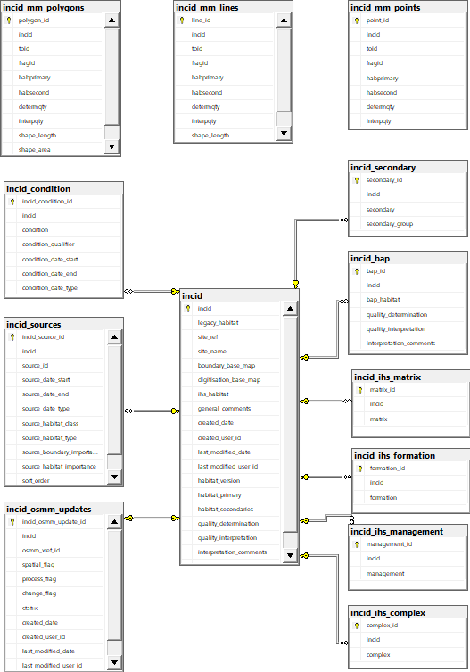

	Database Relationships - Data Tables

.. raw:: latex

	\newpage

Priority Habitat Tables
-----------------------

.. _figDDBT:

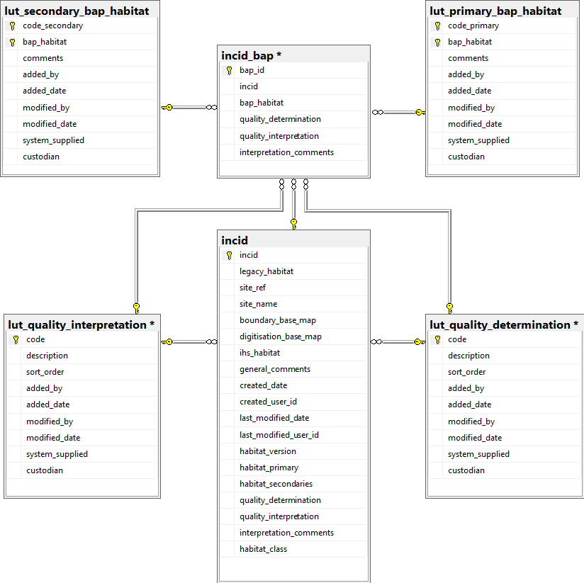

	Database Relationships - Priority Habitat Tables

.. raw:: latex

	\newpage

Habitat Tables
--------------

.. _figDDHaT:

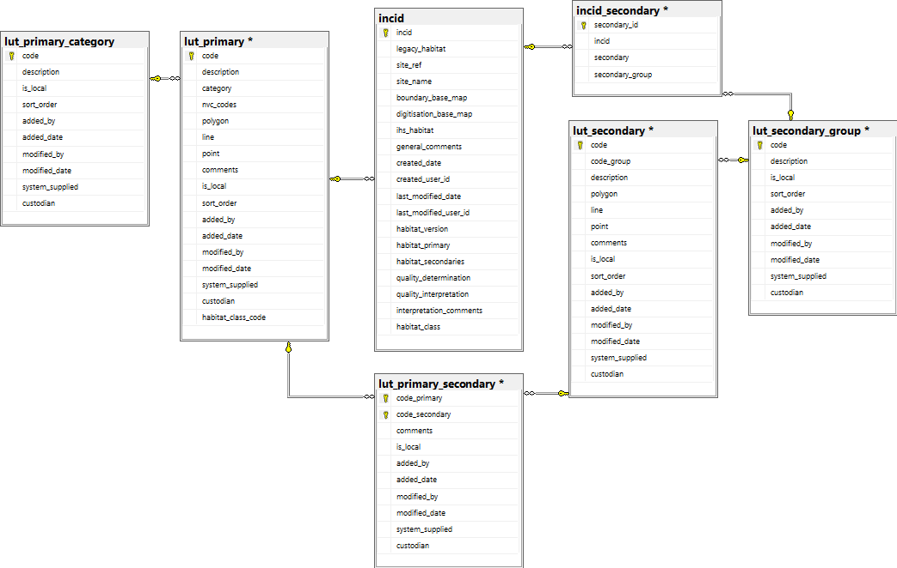

	Database Relationships - Habitat Tables

.. raw:: latex

	\newpage

Habitat Type Tables
--------------------

.. _figDDHaTT:

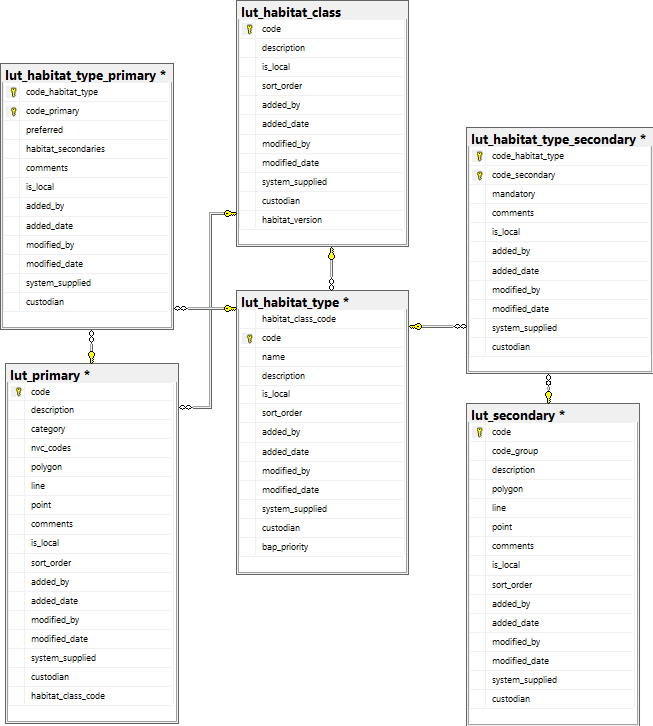

	Database Relationships - Habitat Type Tables

.. raw:: latex

	\newpage

Sources Tables
--------------

.. _figDDST:

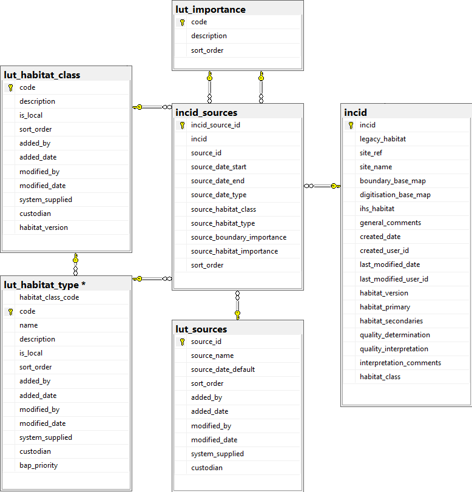

	Database Relationships - Sources Tables

.. raw:: latex

	\newpage

Condition Tables
----------------

.. _figDDCT:

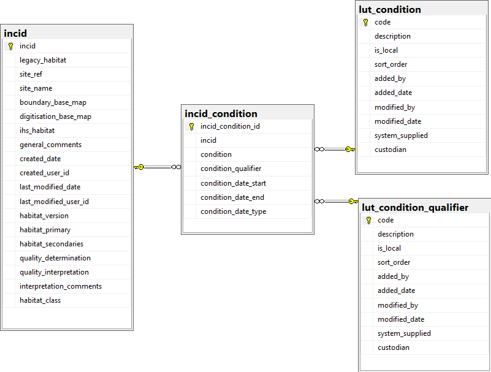

	Database Relationships - Condition Tables

.. raw:: latex

	\newpage

History Tables
--------------

.. _figDDHiT:

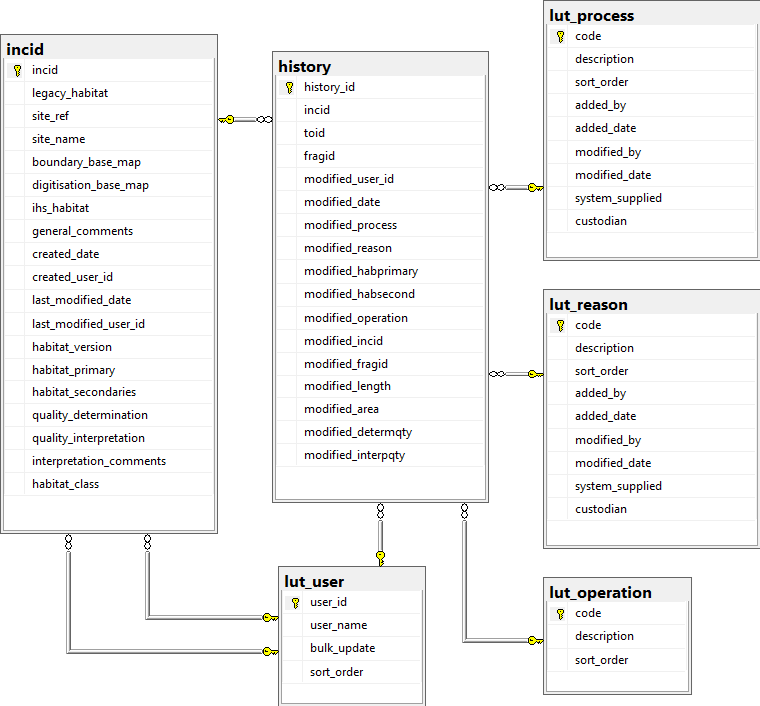

	Database Relationships - History Tables

.. raw:: latex

	\newpage

OS MasterMap Update Tables
--------------------------

.. _figDDOUT:

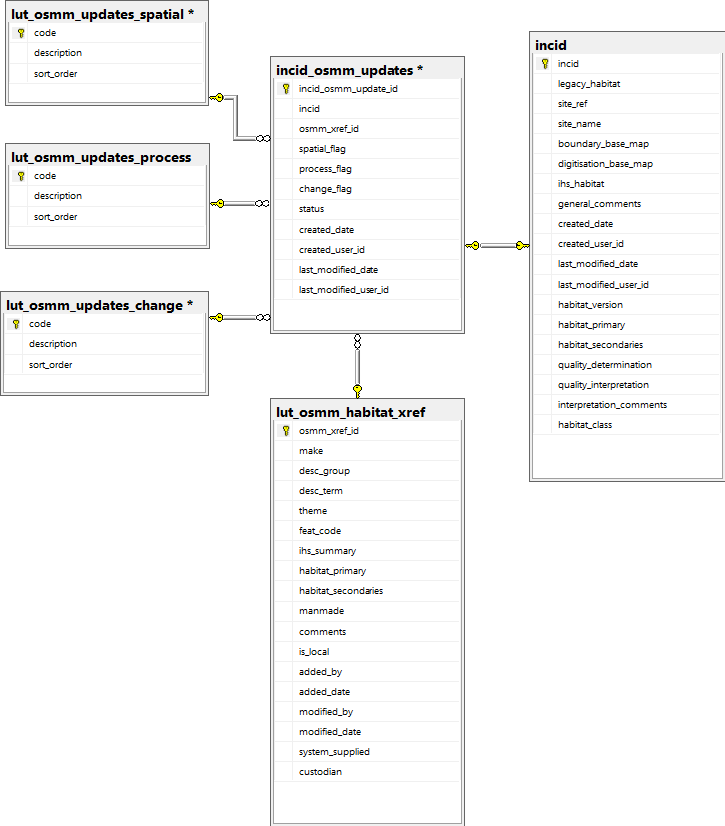

	Database Relationships - OS MasterMap Update Tables

.. raw:: latex

	\newpage

Other Tables
------------

.. _figDDOT:

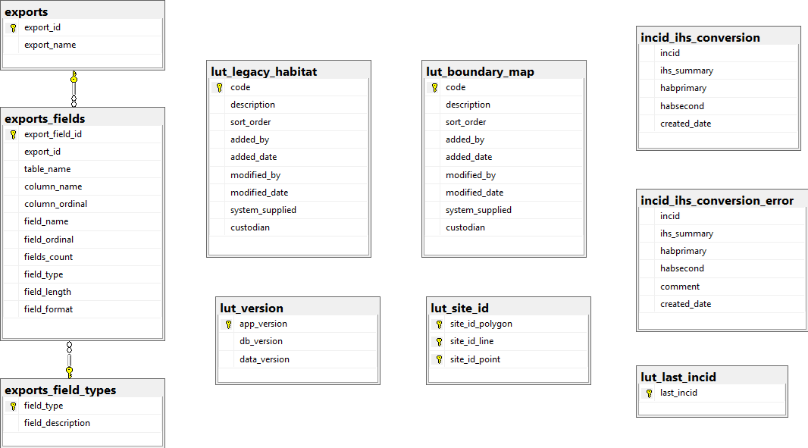

	Database Relationships - Other Tables
